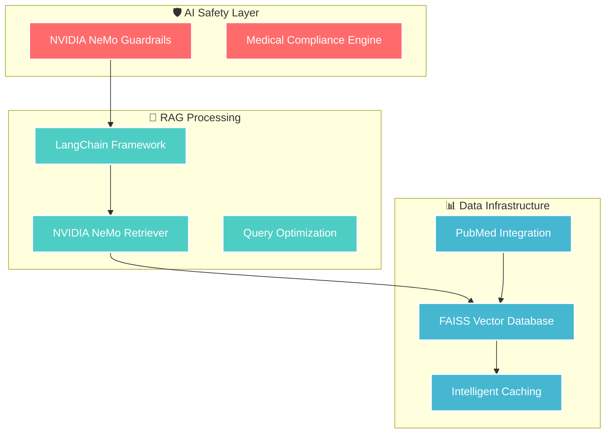

# 🏛️ RAG Template for NVIDIA NemoRetriever

[](https://python.org)
[](https://streamlit.io)
[](https://build.nvidia.com)
[](LICENSE)

A powerful **Retrieval-Augmented Generation (RAG)** template built with **NVIDIA's embedding models** and **LangChain**. This template provides a complete solution for building AI-powered document Q&A systems with a beautiful web interface.

## 🌟 **Features**

- 🤖 **NVIDIA AI Integration**: Uses NVIDIA's high-quality embedding models
- 📄 **PDF Document Processing**: Automatic loading and intelligent chunking
- 🔍 **Vector Search**: FAISS-based similarity search with persistence
- 💬 **Interactive Web UI**: Beautiful Streamlit interface with chat functionality
- 📊 **Advanced Analytics**: Document statistics and source visualization
- 🧪 **Pharmaceutical-Aware Search**: Advanced filtering for drug names, species, therapeutic areas, and study types
- 📊 **Drug Interaction Analysis**: Extract and analyze pharmaceutical metadata from documents
- 🔬 **Clinical Study Filtering**: Filter by study types, year ranges, and ranking scores
- 🧬 **Species-Specific Search**: Target human, animal, or in vitro studies
- 💊 **Drug-Centric Queries**: Search by specific drug names with metadata tie-breaking
- 🔒 **Secure**: Environment-based API key management
- 📱 **Responsive**: Mobile-friendly design
- 🚀 **Production Ready**: Comprehensive error handling and logging

## 🎯 **Perfect For**

- Legal document analysis
- Research paper Q&A systems
- Corporate knowledge bases
- Educational content exploration
- Technical documentation search
- Any domain-specific document collection

## 📢 **Release Notes & Important Changes**

### **Behavior Changes in v2.1+**
- **PubMed Deduplication**: `ENABLE_DEDUPLICATION` now defaults to `true` (was `false` in legacy versions). This removes duplicate articles by DOI/PMID, reducing result counts but improving data quality. To retain raw PubMed results with duplicates, set `ENABLE_DEDUPLICATION=false` in your `.env` file.
- **Ranking Behavior**: When `rank=True` is explicitly passed to PubMed searches, ranking now proceeds even if `PRESERVE_PUBMED_ORDER=true`. This ensures explicit API requests are honored.

### **Developer Notes**
- The PubMed scraper now includes hardened error handling for missing dependencies
- Vector database defaults to single-folder layout for compatibility; set `VECTOR_DB_PER_MODEL=true` for per-model indexing
- CLI entrypoint added: `python -m src.pubmed_scraper "query" --write-sidecars`

## 📋 **Prerequisites**

### **System Requirements**
- **Python**: 3.8 or higher
- **Operating System**: Windows, macOS, or Linux
- **Memory**: 4GB RAM minimum (8GB recommended)
- **Storage**: 2GB free space

### **Required Accounts**
- **NVIDIA Developer Account**: For API access to embedding models
- **Git**: For cloning the repository

## 🔑 **Getting NVIDIA API Key**

### **Step 1: Create NVIDIA Developer Account**
1. Visit [build.nvidia.com](https://build.nvidia.com)
2. Click **"Sign Up"** or **"Log In"** if you have an account
3. Complete the registration process
4. Verify your email address

### **Step 2: Generate API Key**
1. After logging in, navigate to your **Dashboard**
2. Click on **"API Keys"** or **"Credentials"**
3. Click **"Generate New API Key"**
4. Give your key a descriptive name (e.g., "RAG-Template-Key")
5. **Copy and save** the API key securely
6. ⚠️ **Important**: Save this key immediately - you won't be able to see it again!

### **Step 3: Verify API Access**
1. Ensure you have access to:
   - **Embedding Models**: `nvidia/nv-embed-v1`
   - **LLM Models**: `meta/llama-3.1-8b-instruct`
2. Check the [NVIDIA API documentation](https://docs.api.nvidia.com) for current model availability

## 🚀 **Quick Start Guide**

### **Step 1: Clone the Repository**
```bash
git clone https://github.com/zainulabedeen123/RAG-Template-for-NVIDIA-nemoretriever.git
cd RAG-Template-for-NVIDIA-nemoretriever
```

### **Step 2: Set Up Python Environment**

#### **Option A: Using Virtual Environment (Recommended)**
```bash
# Create virtual environment
python -m venv rag_env

# Activate virtual environment
# On Windows:
rag_env\Scripts\activate
# On macOS/Linux:
source rag_env/bin/activate
```

### **Step 3: Install Dependencies**
```bash
# Install core dependencies
pip install -r requirements.txt

# Optional: Install medical safety validation dependencies (for medical/pharmaceutical applications)
# These include advanced PII/PHI detection using Presidio and biomedical NLP with scispaCy
# To enable medical guardrails, run:
pip install -r requirements.txt && pip install -r requirements-medical.txt
```

**Medical Dependencies Details:**
- `presidio-analyzer` and `presidio-anonymizer`: Advanced PII/PHI detection and anonymization
- `spacy`: Industrial-strength NLP library
- `scispacy`: Biomedical NLP models built on spaCy
- `transformers`: State-of-the-art NLP models from Hugging Face

When medical dependencies are installed, the system automatically uses Presidio for more accurate PII/PHI detection. Otherwise, it falls back to regex-based detection.

**To enable medical guardrails**: Set `ENABLE_MEDICAL_GUARDRAILS=true` and run `pip install -r requirements-medical.txt` after the base install.

### **Step 4: Configure Environment**
1. **Copy the environment template**:
   ```bash
   cp .env.template .env
   ```

2. **Edit the `.env` file** with your details:
   ```bash
   # Open .env file in your preferred editor
   notepad .env  # Windows
   nano .env     # Linux/macOS
   ```

3. **Add your NVIDIA API key**:
   ```env
   # NVIDIA API Configuration
   NVIDIA_API_KEY=your_nvidia_api_key_here

   # Configuration (optional - defaults provided)
   DOCS_FOLDER=Data/Docs
   VECTOR_DB_PATH=./vector_db
   CHUNK_SIZE=1000
   CHUNK_OVERLAP=200

   # Drug Lexicon Configuration (optional - for pharmaceutical processing)
   # DRUG_GENERIC_LEXICON=/path/to/custom/generic_drugs.txt
   # DRUG_BRAND_LEXICON=/path/to/custom/brand_drugs.txt
   # AUTO_FETCH_DRUG_LEXICONS=true

   # Guardrails actions (optional)
   # Set only if you host a remote actions server; leave unset to use bundled actions
   ACTIONS_SERVER_URL=http://localhost:8001
   ```

### **Step 5: Add Your Documents**
1. **Create the documents folder** (if not exists):
   ```bash
   mkdir -p Data/Docs
   ```

2. **Add your PDF files** to the `Data/Docs` folder:
   - Copy your PDF documents into this folder
   - The system will automatically process all PDF files
   - Supported formats: `.pdf`

### **Step 6: Test the System**
```bash
# Run the test suite
python test_rag_system.py
```

### **Step 7: Launch the Web Interface**
```bash
# Start the Streamlit web interface
streamlit run streamlit_app.py
```

Or use the convenient launcher:
```bash
python start_web_interface.py
```

### **Step 8: Access Your RAG System**
1. **Open your browser** and navigate to:
   - **Local**: `http://localhost:8501`
   - **Network**: `http://[your-ip]:8501`

2. **Wait for initialization**:
   - The system will load and process your documents
   - This may take a few minutes for large document collections

3. **Start asking questions**!
   - Type your questions in the chat interface
   - Explore the document statistics
   - View detailed source references

## 📁 **Project Structure**

```
RAG-Template-for-NVIDIA-nemoretriever/
├── 📄 README.md                     # This comprehensive guide
├── 📄 requirements.txt              # Python dependencies
├── 📄 .env.template                 # Environment variables template
├── 📄 .gitignore                   # Git ignore rules
├── 📄 streamlit_app.py             # Main web interface
├── 📄 main.py                      # CLI interface
├── 📄 test_rag_system.py           # System tests
├── 📄 start_web_interface.py       # Web interface launcher
├── 📁 src/                         # Core source code
│   ├── 📄 __init__.py
│   ├── 📄 document_loader.py       # PDF processing
│   ├── 📄 nvidia_embeddings.py     # NVIDIA API integration
│   ├── 📄 vector_database.py       # FAISS vector storage
│   └── 📄 rag_agent.py             # Main RAG pipeline
├── 📁 .streamlit/                  # Streamlit configuration
│   └── 📄 config.toml
├── 📁 Data/                        # Document storage
│   └── 📁 Docs/                    # Place your PDF files here
└── 📁 vector_db/                   # Vector database (auto-created)
```

## 🎮 **Usage Examples**

### **Command Line Interface**
```bash
# Use the CLI version
python main.py
```

### **Web Interface**
1. **Start the web interface**:
   ```bash
   streamlit run streamlit_app.py
   ```

2. **Sample questions to try**:
   - "What is the main topic of the documents?"
   - "Summarize the key points from [specific document]"
   - "What are the requirements for [specific process]?"
   - "How does [concept A] relate to [concept B]?"

### **Programmatic Usage**
```python
from src.rag_agent import RAGAgent
from src.pubmed_scraper import PubMedScraper
import os

# Initialize RAG agent
api_key = os.getenv("NVIDIA_API_KEY")
rag_agent = RAGAgent("Data/Docs", api_key)

# Setup knowledge base
rag_agent.setup_knowledge_base()

# Ask questions
response = rag_agent.ask_question("Your question here")
print(response.answer)
print(f"Sources: {len(response.source_documents)}")
if response.disclaimer:
    print(response.disclaimer)

# Preserve raw PubMed ordering when fetching articles programmatically
scraper = PubMedScraper()
articles = scraper.search_pubmed("oncology pharmacology", rank=False)
print(f"Fetched {len(articles)} articles in canonical crawl order")

# When preserving order (rank=False), EasyAPI abstracts are omitted unless ranking is enabled to reduce latency/cost.
```

## 🔧 **Configuration Options**

### **Environment Variables**
| Variable | Description | Default |
|----------|-------------|---------|
| `NVIDIA_API_KEY` | Your NVIDIA API key | **Required** |
| `DOCS_FOLDER` | Path to PDF documents | `Data/Docs` |
| `VECTOR_DB_PATH` | Vector database storage | `./vector_db` |
| `VECTOR_DB_PER_MODEL` | Store vector indexes in per-model subdirectories; auto-migrates compatible legacy data and rebuilds on incompatibilities | `false` |
| `DISABLE_PREFLIGHT_EMBEDDING` | Set to `true` to skip the per-question preflight embedding (lower latency/cost) at the expense of weaker detection when the runtime falls back to a different model | `false` |
| `CHUNK_SIZE` | Document chunk size | `1000` |
| `CHUNK_OVERLAP` | Chunk overlap size | `200` |
| `DRUG_GENERIC_LEXICON` | Optional path to newline-delimited generic drug names | `data/drugs_generic.txt` if present |
| `DRUG_BRAND_LEXICON` | Optional path to newline-delimited brand drug names | `data/drugs_brand.txt` if present |
| `ENABLE_MEDICAL_GUARDRAILS` | Enable medical safety validation features (requires additional dependencies) | `false` |

### **Medical Safety Features**
This template includes optional medical safety validation features that can be enabled for pharmaceutical and healthcare applications. These features provide:

- PII/PHI detection and anonymization using Presidio
- Medical context validation
- Regulatory compliance checking
- Advanced biomedical NLP pipelines using SciSpaCy

To use these features:
1. Install the medical dependencies: `pip install -r requirements-medical.txt`
2. Set `ENABLE_MEDICAL_GUARDRAILS=true` in your environment

### **Customization Options**
- **Chunk Size**: Adjust for different document types
- **Model Selection**: Switch between available NVIDIA models
- **UI Styling**: Modify Streamlit interface in `streamlit_app.py`
- **Processing Logic**: Customize RAG pipeline in `src/rag_agent.py`

### **Vector Database Management**
- **`VECTOR_DB_PER_MODEL`**: When set to `true`, FAISS indexes live in sanitized per-model folders (e.g., `./vector_db/nvidia_llama-3.2-nemoretriever-1b-vlm-embed-v1`). Leaving it `false` keeps the legacy single-folder layout in `VECTOR_DB_PATH`.
- **`embeddings_meta.json`**: Saved next to each index. It records the embedding model name and vector dimension so the agent can detect mismatches before loading older data.
- **Rebuilds & migrations**: On first run with per-model paths, compatible legacy data is migrated automatically; mismatched metadata or dimension changes trigger a rebuild at the reconciled path. Runtime fallback to another embedding model updates the vector DB base path, and logs will tell you to rerun `setup_knowledge_base(force_rebuild=True)` when a rebuild is the safest choice.

### **⚠️ Important: Embedding Model Changes**
Switching embedding models will trigger an automatic index rebuild. This rebuild:
- May take considerable time for large document collections
- Will temporarily slow down all queries until completion
- Is required when model dimensions differ
- Can be avoided by using `VECTOR_DB_PER_MODEL=true`

**Best practices**:
1. Set `VECTOR_DB_PER_MODEL=true` if you frequently switch between models
2. Test new models with small document sets first
3. Monitor logs for rebuild warnings and performance impacts

### **PubMed Scraper CLI**
Run the scraper directly to fetch and cache PubMed results:

```bash
# Module execution (original behavior)
python -m src.pubmed_scraper "metformin glycemic control" --max-items 40 --export-sidecars ./Data/Docs

# Preserve canonical PubMed ordering when ranking isn't desired
python -m src.pubmed_scraper "metformin glycemic control" --no-rank

# Direct script execution is also supported
python src/pubmed_scraper.py "metformin glycemic control"

# Environment toggle for repeated runs without CLI flags
PRESERVE_PUBMED_ORDER=true python -m src.pubmed_scraper "metformin glycemic control"
```

The CLI prints the number of articles found, cache directory statistics, and a preview of the first few results. When `--export-sidecars` is supplied, `.pubmed.json` files are created next to matching PDFs in the specified folder.

## 📚 **PubMed Workflow**

This template provides seamless integration with PubMed for academic and research workflows. Follow these steps to scrape PubMed articles and integrate them with your RAG system:

### **Step 1: Configure APIFY_TOKEN**
1. **Sign up for Apify**: Visit [https://console.apify.com](https://console.apify.com)
2. **Get your API token**: Navigate to Settings → Integrations → API tokens
3. **Add to environment**: Set `APIFY_TOKEN=your_apify_token_here` in your `.env` file

### **Step 2: Scrape PubMed Articles**
```bash
# Scrape articles and export sidecar metadata files
python -m src.pubmed_scraper "diabetes treatment" --export-sidecars Data/Docs

# Advanced usage with more articles
python -m src.pubmed_scraper "cancer immunotherapy" --max-items 50 --export-sidecars Data/Docs

# Preserve original PubMed ordering (no ranking)
python -m src.pubmed_scraper "covid-19 treatment" --no-rank --export-sidecars Data/Docs
```

### **Step 3: Build and Query Knowledge Base**
```bash
# Launch the RAG agent to build knowledge base from documents + sidecars
python -m src.rag_agent

# Or use the web interface
streamlit run streamlit_app.py
```

### **Key Features**
- **Automatic Metadata**: PubMed metadata (DOI, PMID, authors, MeSH terms) is automatically extracted
- **Sidecar Integration**: `.pubmed.json` files provide rich metadata alongside PDFs
- **Deduplication**: Automatic removal of duplicate articles by DOI/PMID and title
- **Medical Disclaimers**: Built-in medical disclaimers for healthcare applications

### **Environment Examples**
The `.env.template` file includes comprehensive PubMed configuration options:
- `APIFY_TOKEN`: Your Apify API token for PubMed scraping
- `PUBMED_CACHE_DIR`: Local cache directory for results
- `ENABLE_STUDY_RANKING`: Enable/disable automatic study quality ranking
- `ENABLE_DEDUPLICATION`: Control duplicate article removal

## 🧪 **Testing**

### **Run All Tests**
```bash
python test_rag_system.py
```

### **Test Individual Components**
```bash
# Test NVIDIA embeddings
python src/nvidia_embeddings.py

# Test document loader
python src/document_loader.py

# Test vector database
python src/vector_database.py

# Test RAG agent
python src/rag_agent.py
```

## 🔍 **Troubleshooting**

### **Common Issues**

#### **1. API Connection Failed**
```
❌ NVIDIA API connection failed
```
**Solutions**:
- Verify your API key is correct in `.env`
- Check internet connection
- Ensure API key has proper permissions
- Visit [NVIDIA API status page](https://status.nvidia.com)

#### **2. No Documents Found**
```
❌ No PDF files found in Data/Docs
```
**Solutions**:
- Ensure PDF files are in `Data/Docs` folder
- Check file permissions
- Verify files are valid PDFs

#### **3. Memory Issues**
```
❌ Out of memory during processing
```
**Solutions**:
- Reduce `CHUNK_SIZE` in `.env`
- Process fewer documents at once
- Increase system RAM

#### **4. Import Errors**
```
❌ ModuleNotFoundError: No module named 'xyz'
```
**Solutions**:
- Ensure virtual environment is activated
- Run `pip install -r requirements.txt`
- Check Python version compatibility

### **Getting Help**
1. **Check the logs**: Look for detailed error messages in console output
2. **Run tests**: Use `python test_rag_system.py` to diagnose issues
3. **Verify setup**: Ensure all prerequisites are met
4. **Check documentation**: Review NVIDIA API documentation

## 🚀 **Deployment Options**

### **Local Development**
- Use the provided scripts for local testing and development

### **Docker Deployment**
```dockerfile
# Example Dockerfile (create as needed)
FROM python:3.9-slim
WORKDIR /app
COPY requirements.txt .
RUN pip install -r requirements.txt
COPY . .
EXPOSE 8501
CMD ["streamlit", "run", "streamlit_app.py"]
```

### **Cloud Deployment**
- **Streamlit Cloud**: Deploy directly from GitHub
- **Heroku**: Use the provided configuration
- **AWS/GCP/Azure**: Deploy using container services

## 🤝 **Contributing**

We welcome contributions! Please follow these steps:

1. **Fork the repository**
2. **Create a feature branch**: `git checkout -b feature/amazing-feature`
3. **Commit changes**: `git commit -m 'Add amazing feature'`
4. **Push to branch**: `git push origin feature/amazing-feature`
5. **Open a Pull Request**

### **Development Setup**
```bash
# Clone your fork
git clone https://github.com/yourusername/RAG-Template-for-NVIDIA-nemoretriever.git

# Install development dependencies
pip install -r requirements.txt

# Run tests before committing
python test_rag_system.py
```

## 📄 **License**

This project is licensed under the MIT License - see the [LICENSE](LICENSE) file for details.

## 🙏 **Acknowledgments**

- **NVIDIA** for providing excellent AI models and APIs
- **LangChain** for the RAG framework
- **Streamlit** for the beautiful web interface framework
- **FAISS** for efficient vector search capabilities

## 📚 **API Reference**

### **Pharmaceutical-Aware Search Methods**

The RAGAgent class now includes powerful pharmaceutical filtering methods:

#### **similarity_search_with_pharmaceutical_filters()**
```python
results = rag_agent.similarity_search_with_pharmaceutical_filters(
    query="drug interactions",
    k=10,
    filters={
        "drug_names": ["aspirin", "warfarin"],
        "species_preference": "human",
        "therapeutic_areas": ["cardiology"],
        "study_types": ["clinical trial"],
        "year_range": [2020, 2024],
        "min_ranking_score": 0.7
    }
)
```

#### **search_by_drug_name()**
```python
# Targeted search for documents about a specific drug
drug_docs = rag_agent.search_by_drug_name("metformin", k=5)
```

#### **get_pharmaceutical_stats()**
```python
# Get comprehensive pharmaceutical statistics
stats = rag_agent.get_pharmaceutical_stats()
print(f"Drug annotation ratio: {stats['drug_annotation_ratio']}")
print(f"Top drugs: {stats['top_drug_names']}")
```

### **Available Filters**

- **drug_names**: Filter by specific drug names
- **species_preference**: Target species (human, mouse, rat, etc.)
- **therapeutic_areas**: Filter by medical domains
- **study_types**: Include specific study designs
- **year_range**: Limit by publication years
- **min_ranking_score**: Set minimum relevance threshold
- **include_unknown_species**: Control handling of unspecified species

### **Example Usage**
```python
# Find high-quality human clinical trials about cardiovascular drugs
results = rag_agent.similarity_search_with_pharmaceutical_filters(
    query="treatment outcomes",
    k=10,
    filters={
        "therapeutic_areas": ["cardiology"],
        "species_preference": "human",
        "study_types": ["randomized controlled trial"],
        "min_ranking_score": 0.8
    }
)
```

## 📞 **Support**

- **Issues**: [GitHub Issues](https://github.com/zainulabedeen123/RAG-Template-for-NVIDIA-nemoretriever/issues)
- **Discussions**: [GitHub Discussions](https://github.com/zainulabedeen123/RAG-Template-for-NVIDIA-nemoretriever/discussions)
- **Documentation**: Check the `WEB_INTERFACE_GUIDE.md` and `SETUP_GUIDE.md` files for additional guides

---

**🎉 Happy Building! Create amazing RAG applications with NVIDIA's powerful AI models! 🚀**

### *Enterprise-grade AI system for pharmaceutical research and drug discovery*

---

[](https://python.org)
[](https://nvidia.com)
[](https://langchain.com)
[](https://faiss.ai)
[](https://docker.com)
[](LICENSE)

---


</div>

---

## 🎯 **Executive Summary**

> **A production-ready AI system** that combines **NVIDIA NeMo Guardrails**, **LangChain RAG framework**, and **FAISS vector database** to revolutionize pharmaceutical research. Built for enterprise-grade safety, compliance, and performance.

<div align="center">

| 🚀 **Performance** | 🛡️ **Safety** | 💰 **Efficiency** | 🔬 **Intelligence** |
|:--:|:--:|:--:|:--:|
| <2 min response | 100% compliance | 70% cost reduction | 1000+ papers indexed |

</div>

---

## 🏗️ **System Architecture**

<div align="center">



</div>

---

## ⚡ **Core Technologies**

<div align="center">

<table>
<tr>
<td align="center" width="16%">

<br><b>AI Safety</b><br>
<small>Guardrails, Content Validation</small>
</td>
<td align="center" width="16%">

<br><b>RAG Engine</b><br>
<small>Document Retrieval, Chains</small>
</td>
<td align="center" width="16%">

<br><b>Vector Search</b><br>
<small>High-Performance Indexing</small>
</td>
<td align="center" width="16%">

<br><b>Data Source</b><br>
<small>Medical Literature</small>
</td>
<td align="center" width="16%">

<br><b>Container</b><br>
<small>Production Deployment</small>
</td>
<td align="center" width="16%">

<br><b>Web UI</b><br>
<small>Interactive Dashboard</small>
</td>
</tr>
</table>

</div>

---

## 🚀 **Key Features**

<div align="center">

### 🛡️ **Enterprise AI Safety**
> *NVIDIA NeMo Guardrails Integration*

</div>

- **🔒 Medical Content Validation** - Real-time safety boundary enforcement
- **🚨 Hallucination Detection** - Pharmaceutical accuracy verification  
- **🛡️ PII/PHI Protection** - Healthcare compliance automation
- **⚡ Content Moderation** - Intelligent filtering and validation

<div align="center">

### ⚡ **Advanced RAG Processing**
> *LangChain Framework Implementation*

</div>

- **🔗 Sophisticated Retrieval Chains** - Multi-step pharmaceutical reasoning
- **🧠 Prompt Engineering** - Medical domain optimization
- **💭 Chain-of-Thought** - Complex clinical evidence processing
- **📚 Document Orchestration** - Advanced paper synthesis

<div align="center">

### 🔍 **High-Performance Vector Search**
> *FAISS Database Optimization*

</div>

- **⚡ Sub-Second Search** - Across 1,000+ research papers
- **🎯 Optimized Indexing** - Pharmaceutical document embeddings
- **💾 Persistent Storage** - Automatic backup mechanisms
- **📈 Scalable Architecture** - Million+ document support

---

## 📊 **Performance Metrics**

<div align="center">

<table>
<tr>
<th>🎯 Performance Indicator</th>
<th>📈 Target Specification</th>
<th>💼 Business Impact</th>
</tr>
<tr>
<td><strong>Query Response Time</strong></td>
<td><code>< 120 seconds</code></td>
<td>⚡ Real-time research workflow</td>
</tr>
<tr>
<td><strong>Vector Search Latency</strong></td>
<td><code>< 50ms (FAISS)</code></td>
<td>🔍 Instantaneous similarity matching</td>
</tr>
<tr>
<td><strong>API Cost Optimization</strong></td>
<td><code>70% reduction via caching</code></td>
<td>💰 Sustainable operational model</td>
</tr>
<tr>
<td><strong>Safety Validation</strong></td>
<td><code>100% guardrail coverage</code></td>
<td>🛡️ Regulatory compliance</td>
</tr>
<tr>
<td><strong>Research Coverage</strong></td>
<td><code>1,000+ documents indexed</code></td>
<td>📚 Comprehensive literature</td>
</tr>
<tr>
<td><strong>Evidence Classification</strong></td>
<td><code>95% accuracy (RCT/Review)</code></td>
<td>🎯 Quality-prioritized results</td>
</tr>
</table>

</div>

---

## 🚀 **Quick Start**

<div align="center">

### 📋 **Prerequisites**

</div>

```bash
# 🔑 Required API Credentials
export NVIDIA_API_KEY="your_nvidia_api_key"
export APIFY_API_TOKEN="your_apify_token"

# 💻 System Requirements
Python 3.11+ | Docker & Docker Compose | 8GB RAM
```

<div align="center">

### 🐳 **Docker Deployment** *(Recommended)*

</div>

```bash
# 📥 Clone Repository
git clone https://github.com/[username]/pharmaceutical-rag-knowledge-expert.git
cd pharmaceutical-rag-knowledge-expert

# ⚙️ Configure Environment
cp .env.template .env
# Edit .env with your API credentials

# 🚀 Launch Multi-Service Architecture
docker-compose up --build

# 🌐 Access Web Interface
open http://localhost:8501
```

<div align="center">

### 🔧 **Local Development**

</div>

```bash
# 🐍 Create Virtual Environment
python -m venv venv
source venv/bin/activate  # Windows: venv\Scripts\activate

# 📦 Install Dependencies
pip install -r requirements.txt

# 🗂️ Initialize FAISS Vector Database
python src/initialize_vector_db.py

# 🎨 Launch Streamlit Application
streamlit run streamlit_app.py
```

---

## 💻 **Advanced Usage Examples**

<div align="center">

### 🛡️ **Drug Safety Analysis with NeMo Guardrails**

</div>

```python
from src.enhanced_rag_agent import GuardedPharmaceuticalRAGAgent

# 🚀 Initialize with comprehensive safety guardrails
rag_agent = GuardedPharmaceuticalRAGAgent(
    docs_folder="./Data/Pharmaceutical_Papers",
    api_key=os.getenv("NVIDIA_API_KEY"),
    guardrails_config="./guardrails"
)

# 🔍 Query with medical safety validation
response = await rag_agent.ask_question_safe(
    "What are the cardiovascular adverse effects of atorvastatin in elderly patients?",
    query_type="drug_safety"
)

# ✅ Response includes:
# - NVIDIA Guardrails validation
# - Automatic medical disclaimer  
# - FAISS-powered source retrieval
# - Evidence hierarchy ranking
```

<div align="center">

### 🔗 **Advanced LangChain Pipeline Processing**

</div>

```python
from langchain.chains import RetrievalQA
from src.enhanced_pubmed_scraper import EnhancedPubMedScraper

# ⚡ Initialize enhanced scraper with intelligent caching
scraper = EnhancedPubMedScraper(
    api_token=os.getenv("APIFY_API_TOKEN"),
    enable_rate_limiting=True,
    enable_caching=True
)

# 🧠 Process pharmaceutical query with optimization
papers_response = await scraper.search_and_rank_pharmaceutical(
    query="ketoconazole midazolam CYP3A4 pharmacokinetic interaction",
    max_items=50,
    query_type="drug_interaction"
)

# 🎯 Returns evidence-ranked results with FAISS similarity scores
```

<div align="center">

### 🔍 **FAISS Vector Database Operations**

</div>

```python
from src.vector_database import VectorDatabase
from src.nvidia_embeddings import NVIDIAEmbeddings

# 🚀 Initialize high-performance components
embeddings = NVIDIAEmbeddings(api_key=os.getenv("NVIDIA_API_KEY"))
vector_db = VectorDatabase(embeddings, "./pharmaceutical_vector_db")

# ⚡ Lightning-fast similarity search
similar_docs = vector_db.similarity_search_with_scores(
    query="warfarin drug interactions",
    k=10,
    score_threshold=0.8
)

# 📊 Returns: [(Document, similarity_score), ...]
```

---

## 📁 **Project Structure**

<div align="center">

```
🧬 pharmaceutical-rag-knowledge-expert/
├── 🤖 src/
│   ├── enhanced_rag_agent.py           # 🛡️ GuardedPharmaceuticalRAGAgent
│   ├── enhanced_pubmed_scraper.py      # 📚 NCBI-compliant API integration
│   ├── nvidia_embeddings.py            # 🚀 NVIDIA NeMo Retriever
│   ├── vector_database.py              # ⚡ FAISS operations & optimization
│   ├── medical_guardrails.py           # 🛡️ NeMo Guardrails safety
│   └── query_optimization.py           # 🔍 PubMed enhancement engine
├── 🛡️ guardrails/
│   ├── config.yml                      # ⚙️ NeMo Guardrails configuration
│   ├── rails/medical_rails.co          # 📋 Medical safety rules
│   └── actions.py                      # 🔧 Custom safety actions
├── 🐳 containers/
│   ├── docker-compose.yml              # 🏭 Production deployment
│   ├── app.Dockerfile                  # 📦 Main application container
│   └── guardrails.Dockerfile           # 🛡️ Safety service container
├── 🧪 tests/
│   ├── test_nvidia_integration.py      # 🤖 NeMo testing suite
│   ├── test_faiss_performance.py       # ⚡ Vector DB benchmarks
│   ├── test_langchain_chains.py        # 🔗 RAG pipeline validation
│   └── test_pharmaceutical_queries.py  # 🧬 Domain functionality
├── 📚 docs/
│   ├── nvidia-integration-guide.md     # 🛡️ Guardrails implementation
│   ├── faiss-optimization.md           # ⚡ Performance tuning
│   ├── langchain-architecture.md       # 🔗 Framework patterns
│   └── api-compliance-guide.md         # 📋 Best practices
└── 🗂️ data/
    ├── vector_db/                      # 💾 FAISS index storage
    └── cache/                          # 📦 API response caching
```

</div>

---

## 🔬 **Research Applications**

<div align="center">

<table>
<tr>
<td align="center" width="50%">

### 🏥 **Pharmaceutical Research**
- 📚 **Literature Review Automation**
- 🔬 **Evidence Synthesis & Meta-Analysis**
- 💊 **Drug Repurposing Discovery**
- 🚨 **Safety Signal Detection**

</td>
<td align="center" width="50%">

### 📋 **Regulatory & Compliance**
- 📝 **FDA/EMA Submission Preparation**
- 🧪 **Clinical Trial Design Optimization**
- ⚠️ **Pharmacovigilance Monitoring**
- ✅ **Quality Assurance Validation**

</td>
</tr>
</table>

</div>

---

## 🧪 **Quality Assurance**

<div align="center">

### 🔬 **Comprehensive Test Suite**

</div>

```bash
# 🤖 NVIDIA Integration Testing
pytest tests/test_nvidia_integration.py -v

# ⚡ FAISS Performance Benchmarking  
python tests/test_faiss_performance.py --benchmark

# 🔗 LangChain Pipeline Validation
pytest tests/test_langchain_chains.py --integration

# 🛡️ Medical Safety Compliance
python tests/test_medical_compliance.py --guardrails
```

<div align="center">

### 📊 **Real-Time Monitoring Dashboard**

</div>

```python
from src.monitoring import PharmaceuticalSystemMonitor

# 📈 Initialize comprehensive monitoring
monitor = PharmaceuticalSystemMonitor()
metrics = monitor.get_real_time_metrics()

# 🎯 Tracks Performance Indicators:
# - ⚡ FAISS query latency & throughput
# - 🤖 NVIDIA API response times & costs
# - 🔗 LangChain execution duration
# - 🛡️ Guardrails validation overhead
# - 💰 Cache hit ratios & cost savings
```

---

## 🎓 **Academic Context**

<div align="center">

<table>
<tr>
<td align="center">

### 🏫 **Educational Framework**
**🎓 Institution**: Concordia University  
**💻 Program**: Computer Engineering Co-op  

</td>
<td align="center">

</td>
</tr>
</table>

</div>

---

## 📞 **Contact & Collaboration**

<div align="center">

### 👨‍💻 **Student Developer**

**🎓 [Hendrix Majumdar-Moreau]**  
*Computer Engineering Co-op Student*  
*Concordia University*

---

[]([Your LinkedIn])
[](mailto:[your-email])
[]([Your GitHub])

</div>

---

## 📄 **License**

<div align="center">

This project is licensed under the **MIT License**

[](LICENSE)

**🎓 Academic Use**: Encouraged for educational research  
**💼 Commercial Use**: Available under MIT terms  
**📖 Attribution**: Please cite in academic/professional contexts

</div>

---

<div align="center">

## 🌟 **Advancing Pharmaceutical Research Through AI Innovation**

---


*Demonstrating enterprise-grade AI system development with pharmaceutical expertise*

[]()

---

⭐ **Star this repository if it helps with your research!** ⭐

