# 🏛️ RAG Template for NVIDIA NemoRetriever

[](https://python.org)
[](https://streamlit.io)
[](https://build.nvidia.com)
[](LICENSE)
[](docs/NGC_DEPRECATION_IMMUNITY.md)

A powerful **Retrieval-Augmented Generation (RAG)** template built with **NVIDIA's embedding models** and **LangChain**. This template provides a complete solution for building AI-powered document Q&A systems with a beautiful web interface.

## 🌟 **Features**

### **🚀 2025 NeMo 2.0 Hybrid Architecture**
- 🤖 **NVIDIA NeMo Retriever**: Latest 2025 NIM-based embedding and reranking models
- ⚡ **Hybrid Approach**: Leverages NeMo's best-in-class parsing while preserving pharmaceutical expertise
- 🧠 **Multi-Model Intelligence**: E5-v5, Mistral7B-v2, and Arctic-Embed-L model selection
- 🔄 **Backward Compatibility**: Seamless fallback to legacy NVIDIA API endpoints

### **💊 Pharmaceutical Domain Excellence**
- 🧪 **Medical Guardrails**: Modular safety validation with FDA compliance
- 📊 **Drug Interaction Analysis**: Extract and analyze pharmaceutical metadata from documents
- 🔬 **Clinical Study Filtering**: Filter by study types, year ranges, and ranking scores
- 🧬 **Species-Specific Search**: Target human, animal, or in vitro studies
- 💊 **Drug-Centric Queries**: Search by specific drug names with metadata tie-breaking
- 🛡️ **Safety-First**: All outputs undergo medical validation and disclaimer insertion

### **🏗️ Modern Architecture**
- 📄 **Advanced Document Processing**: VLM-based OCR and structured data extraction
- 🔍 **GPU-Accelerated Search**: cuVS vector search with FAISS fallback
- 💬 **Interactive Web UI**: Beautiful Streamlit interface with chat functionality
- 📊 **Real-Time Analytics**: Performance monitoring and pharmaceutical insights
- 🔒 **Enterprise Security**: Environment-based configuration and authentication
- 📱 **Production Ready**: Comprehensive error handling, logging, and testing

### **🛡️ Future-Proof Architecture (NGC Deprecation Immune)**
- ✅ **NGC Deprecation Immune**: Zero impact from March 2026 NGC API deprecation
- 🌐 **Cloud-First Strategy**: NVIDIA Build platform (`integrate.api.nvidia.com`) as primary endpoint
- 🔄 **OpenAI SDK Integration**: Standardized, maintainable API access via industry-standard wrapper
- 📊 **Cost Optimization**: Free tier maximization (10,000 requests/month) for budget-conscious research
- 🔧 **Self-Hosted Fallback**: Complete independence from cloud services with optional Docker deployment
- 🛡️ **6+ Months Head Start**: Already migrated before March 2026 deadline
- 📝 **Automated Validation**: `scripts/audit_ngc_dependencies.sh` continuously verifies NGC independence
- 📚 **Comprehensive Documentation**: [NGC_DEPRECATION_IMMUNITY.md](docs/NGC_DEPRECATION_IMMUNITY.md) for complete details

## 🎯 **Perfect For**

- Legal document analysis
- Research paper Q&A systems
- Corporate knowledge bases
- Educational content exploration
- Technical documentation search
- Any domain-specific document collection

## 📁 **Clean Architecture**

### **🗂️ Directory Structure**
```
RAG-Template-for-NVIDIA-nemoretriever/
├── 📄 README.md                    # This documentation
├── 📄 requirements.txt             # Core dependencies
├── 📄 requirements-nemo.txt        # NeMo-specific GPU acceleration
├── 📄 requirements-medical.txt     # Medical guardrails dependencies
├── 📄 streamlit_app.py            # Main web interface
├── 📄 main.py                     # CLI interface
├── 📁 src/                        # Core source code
│   ├── 📄 enhanced_rag_agent.py   # Main RAG orchestration
│   ├── 📄 nvidia_embeddings.py    # Hybrid NVIDIA embedding service
│   ├── 📄 medical_guardrails.py   # Safety & compliance system
│   ├── 📄 pubmed_scraper.py       # PubMed integration & scraping
│   ├── 📁 integrations/           # External service integrations
│   │   ├── 📄 agent_integration.py # Agent system integration
│   │   └── 📄 mcp_client.py        # Model Control Protocol client
│   └── 📁 utils/                  # Utility functions
├── 📁 tests/                      # Comprehensive test suite
├── 📁 examples/                   # Usage examples
├── 📁 scripts/                    # Utility scripts
│   ├── 📄 nemo_environment_validator.py # Environment validation
│   └── 📄 check_deps.py           # Dependency checker
└── 📁 guardrails/                 # Medical safety framework
    ├── 📄 actions.py              # Main safety actions
    └── 📁 modules/                # Modular safety components
        ├── 📄 disclaimer_management.py # Disclaimer utilities
        └── 📄 source_metadata_utils.py # Metadata handling
```

### **🏗️ Modular Design Principles**
- **Separation of Concerns**: Each module has a focused responsibility
- **Backward Compatibility**: Existing imports continue to work
- **Pharmaceutical Safety**: Medical guardrails are modular and maintainable
- **Testing**: Comprehensive test coverage in organized structure
- **Examples**: Clear usage patterns in dedicated directory

## 📢 **Release Notes & Important Changes**

### **Behavior Changes in v2.1+**
- **PubMed Deduplication**: `ENABLE_DEDUPLICATION` now defaults to `true` (was `false` in legacy versions). This removes duplicate articles by DOI/PMID, reducing result counts but improving data quality. To retain raw PubMed results with duplicates, set `ENABLE_DEDUPLICATION=false` in your `.env` file.
- **Ranking Behavior**: When `rank=True` is explicitly passed to PubMed searches, ranking now proceeds even if `PRESERVE_PUBMED_ORDER=true`. This ensures explicit API requests are honored.

### **Developer Notes**
- The PubMed scraper now includes hardened error handling for missing dependencies
- Vector database defaults to single-folder layout for compatibility; set `VECTOR_DB_PER_MODEL=true` for per-model indexing
- CLI entrypoint added: `python -m src.pubmed_scraper "query" --write-sidecars`

## 🧪 NIM-Native PubMed Pipeline (Cheapest Path)

Run a minimal PubMed → Embed → Rerank pipeline via NVIDIA Build-hosted NIMs with credit-aware logging and strict health gating.

Quick start:
- Set in `.env`: `NVIDIA_API_KEY=...`, `ENABLE_NEMO_EXTRACTION=true`, `NEMO_EXTRACTION_STRATEGY=nemo`, `NEMO_EXTRACTION_STRICT=true`, `APP_ENV=production`, `PHARMA_DOMAIN_OVERLAY=true`.
- Optional: `EMBEDDING_MODEL`, `RERANK_MODEL`, `NEMO_*_ENDPOINT` (self-hosted), `NVIDIA_BUILD_FREE_TIER=true`.

Examples:
- Validate config + run: `python -m scripts.pubmed_nim_pipeline --query "metformin pharmacokinetics" --batch-size 3 --top-k 5`
- Bypass health for ad‑hoc runs: `python -m scripts.pubmed_nim_pipeline --query "cyp3a4 inhibitors" --skip-health`
- Tighten health latency: `python -m scripts.pubmed_nim_pipeline --query "drug label safety" --health-latency-ms 2500`
- PubMed-only testing (no NIM calls): `python -m scripts.pubmed_nim_pipeline --query "metformin pharmacokinetics" --pubmed-only --skip-health`

Outputs:
- Compact Markdown health table with masked key
- Per‑phase latencies and approximate credits (if `NVIDIA_BUILD_FREE_TIER=true`)
- Persisted summaries/benchmarks under `persist/`

Troubleshooting:
- See `docs/TROUBLESHOOTING_NVIDIA_BUILD.md` for common 401/404/422, model/endpoint mismatches, and latency gating.


## 📋 **Prerequisites**

### **System Requirements**
- **Python**: 3.8 or higher
- **Operating System**: Windows, macOS, or Linux
- **Memory**: 4GB RAM minimum (8GB recommended)
- **Storage**: 2GB free space

### **Required Accounts**
- **NVIDIA Developer Account**: For API access to embedding models
- **Git**: For cloning the repository

## 🔑 **Getting NVIDIA API Key**

### **Step 1: Create NVIDIA Developer Account**
1. Visit [build.nvidia.com](https://build.nvidia.com)
2. Click **"Sign Up"** or **"Log In"** if you have an account
3. Complete the registration process
4. Verify your email address

### **Step 2: Generate API Key**
1. After logging in, navigate to your **Dashboard**
2. Click on **"API Keys"** or **"Credentials"**
3. Click **"Generate New API Key"**
4. Give your key a descriptive name (e.g., "RAG-Template-Key")
5. **Copy and save** the API key securely
6. ⚠️ **Important**: Save this key immediately - you won't be able to see it again!

### **Step 3: Verify API Access**
1. Ensure you have access to:
   - **Embedding Models**: `nvidia/nv-embed-v1`
   - **LLM Models**: `meta/llama-3.1-8b-instruct`
2. Check the [NVIDIA API documentation](https://docs.api.nvidia.com) for current model availability

## 🔒 **Security & API Key Management**

### **⚠️ CRITICAL: Never Commit API Keys**

This repository uses a **secure environment configuration pattern**:

1. **`.env.example`** (✅ Tracked in Git)
   - Contains placeholder values for all configuration
   - Safe to commit and share
   - Used as template for local setup

2. **`.env`** (❌ NOT Tracked in Git)
   - Contains your real API keys
   - **NEVER commit this file**
   - Listed in `.gitignore` for safety

### **🛡️ Setup Your Local Environment**

```bash
# 1. Copy the example file
cp .env.example .env

# 2. Edit .env and add your real API keys
# Replace placeholders with actual values:
# NVIDIA_API_KEY=your_actual_nvidia_api_key_here
# PUBMED_EUTILS_API_KEY=your_actual_pubmed_key_here
# PUBMED_EMAIL=your_actual_email@example.com
```

### **🚨 If You've Committed Keys Accidentally**

If you accidentally committed API keys:

1. **Immediately rotate the exposed keys** at their respective portals
2. **Remove from Git history** (requires force push):
   ```bash
   # Use BFG Repo-Cleaner or git-filter-repo
   # WARNING: This rewrites history
   ```
3. **Update `.env` with new keys** (locally only)

### **✅ CI/CD Best Practices**

- GitHub Actions uses **GitHub Secrets**, not the `.env` file
- Set secrets in: Repository Settings → Secrets and Variables → Actions
- Required secrets:
  - `NVIDIA_API_KEY`
  - `PUBMED_EUTILS_API_KEY` (optional)

## ✅ Testing Notes (Pharma Disclaimers & Async)

To run the disclaimer-related tests locally with minimal friction:

- Ensure pytest knows about the `asyncio` marker (our CI uses strict markers):
  - Option A (per run): add `-o markers="asyncio: asyncio tests"`
  - Option B (global): add a `markers` entry for `asyncio` in your local pytest.ini

- Run only the disclaimer tests (no network required):
  ```bash
  pytest -q tests/test_disclaimer_flags.py -o markers="asyncio: asyncio tests"
  ```

These tests inject a dummy cloud client into `EnhancedNeMoClient` to avoid external calls. If you want to exercise the full OpenAI/NVIDIA Build stack in tests, install the SDK and export your key:

```bash
pip install 'openai>=1.0.0,<2.0.0'
export NVIDIA_API_KEY=your_key
pytest -q -o markers="asyncio: asyncio tests"
```

Important flags used by the chat+disclaimer flow:
- `PHARMA_REQUIRE_DISCLAIMER=true` enforces a disclaimer in responses.
- `APPEND_DISCLAIMER_IN_ANSWER=true|false` controls whether the disclaimer is appended to the text or just flagged in the payload via `disclaimer_added` and `disclaimer_text`.

## 🧪 Rerank Cloud‑First Behavior

Rerank ordering is driven by `ENABLE_CLOUD_FIRST_RERANK`:
- `true` → NVIDIA Build rerank first, then NeMo reranking
- `false` → NeMo reranking first, then NVIDIA Build rerank

`ENABLE_NVB_RERANK` is treated as legacy; if explicitly set to `false`, it disables NVIDIA Build rerank regardless of ordering.

### Rerank Retry/Backoff Tuning

Use these environment variables to tune retry behavior for rerank calls. Sensible defaults avoid multi‑minute waits and keep jitter optional.

- `RERANK_RETRY_BACKOFF_BASE` (float, seconds; default: `0.5`)
  - Base for exponential backoff: delay = base × 2^attempt.
- `RERANK_RETRY_MAX_ATTEMPTS` (int; default: `3`)
  - Max retry attempts before surfacing an error (total tries = attempts + 1).
- `RERANK_RETRY_JITTER` (bool; default: `true`)
  - When true, adds uniform jitter in `[0, base]` to each computed delay.

Advanced (code) overrides when constructing clients:
- `NVIDIABuildConfig.request_backoff_base` (seconds)
- `NVIDIABuildConfig.request_backoff_jitter` (seconds amplitude; `0` disables jitter)
- `NVIDIABuildConfig.rerank_retry_max_attempts` (int)

Per‑call overrides are also available on the wrapper method:
- `OpenAIWrapper.rerank(..., max_retries=?, backoff_base=?, backoff_jitter=?)`

## 💊 Pharma Environment Variables

These environment variables control pharmaceutical behavior. `EnhancedRAGConfig.from_env` reads them and they flow into clients and feature flags:

- `PHARMACEUTICAL_RESEARCH_MODE` (bool)
  - Global pharma mode toggle exposed via `get_feature_flags()["pharmaceutical_research_mode"]`.
- `PHARMACEUTICAL_FEATURE_DRUG_INTERACTION_ANALYSIS` (bool)
- `PHARMACEUTICAL_FEATURE_CLINICAL_TRIAL_PROCESSING` (bool)
- `PHARMACEUTICAL_FEATURE_PHARMACOKINETICS_OPTIMIZATION` (bool)
  - Enable/disable specific pharma feature families.
- `PHARMA_RESEARCH_PROJECT_BUDGETING` (bool)
- `PHARMA_PROJECT_ID` (str)
- `PHARMA_BUDGET_LIMIT_USD` (float)
- `PHARMA_COST_PER_QUERY_TRACKING` (bool)
  - Cost monitoring and budgeting used by the NVIDIA Build client. When budgeting is on, provide a positive `PHARMA_BUDGET_LIMIT_USD`.

Related compliance and QA toggles:
- `PHARMA_COMPLIANCE_MODE`, `PHARMA_REQUIRE_DISCLAIMER`, `PHARMA_REGION`,
  `PHARMA_QUALITY_ASSURANCE_ENABLED`, `PHARMA_MEDICAL_TERMINOLOGY_VALIDATION`,
  `PHARMA_WORKFLOW_TEMPLATES_ENABLED`, `PHARMA_SPECIALIZED_METRICS_ENABLED`.

Tip: All of the above can be set in `.env`. See `src/enhanced_config.py` for defaults and mapping.

### Pharma Benchmarks CLI

Run the integrated capability checks against your current configuration:

```bash
python scripts/pharma_benchmarks_cli.py --pretty \
  --fallback=true \
  --api-key "$NVIDIA_API_KEY"
```

- Exit codes: 0 on success/partial, 1 on failure
- Uses `.env` via `EnhancedRAGConfig.from_env()` and respects programmatic overrides

## 🧩 Vector DB and Model Dimensions

Switching embedding models (e.g., 4096 ↔ 1024 dims) requires either per‑model vector stores or a rebuild. This template defaults to:

```env
VECTOR_DB_PER_MODEL=true
```

If you disable per‑model storage, startup will validate FAISS index dimensions and raise a clear error when mismatched, suggesting either enabling per‑model directories or re‑indexing the corpus.

## 🚀 **Quick Start Guide**

### **Step 1: Clone the Repository**
```bash
git clone https://github.com/zainulabedeen123/RAG-Template-for-NVIDIA-nemoretriever.git
cd RAG-Template-for-NVIDIA-nemoretriever
```

### **Step 2: Set Up Python Environment**

#### **Option A: Using Virtual Environment (Recommended)**
```bash
# Create virtual environment
python -m venv rag_env

# Activate virtual environment
# On Windows:
rag_env\Scripts\activate
# On macOS/Linux:
source rag_env/bin/activate
```

### **Step 3: Install Dependencies**

#### **🎯 Choose Your Installation Type**

**🔥 Standard Installation (CPU-only)**
```bash
# Core dependencies - works on any system
pip install -r requirements.txt
```

**⚡ NeMo GPU Acceleration (Recommended)**
```bash
# GPU-accelerated NeMo Retriever with cuVS vector search
pip install -r requirements.txt -r requirements-nemo.txt
```

**🏥 Medical/Pharmaceutical Complete**
```bash
# Full medical safety validation with PII/PHI detection
pip install -r requirements.txt -r requirements-medical.txt
```

**🚀 Full Enterprise Setup**
```bash
# Everything: Core + NeMo GPU + Medical Guardrails
pip install -r requirements.txt -r requirements-nemo.txt -r requirements-medical.txt
```

#### **💡 Installation Notes**
- **requirements.txt**: Core functionality, backward-compatible
- **requirements-nemo.txt**: GPU acceleration, CUDA 12.x optimized (deduplicated)
- **requirements-medical.txt**: Advanced medical safety, Presidio PII detection

**Medical Dependencies Details:**
- `presidio-analyzer` and `presidio-anonymizer`: Advanced PII/PHI detection and anonymization
- `spacy`: Industrial-strength NLP library
- `scispacy`: Biomedical NLP models built on spaCy
- `transformers`: State-of-the-art NLP models from Hugging Face

When medical dependencies are installed, the system automatically uses Presidio for more accurate PII/PHI detection. Otherwise, it falls back to regex-based detection.

**To enable medical guardrails**: Set `ENABLE_MEDICAL_GUARDRAILS=true` and run `pip install -r requirements-medical.txt` after the base install.

### **Step 4: Configure Environment**
1. **Copy the environment template**:
   ```bash
   cp .env.template .env
   ```

2. **Edit the `.env` file** with your details:
   ```bash
   # Open .env file in your preferred editor
   notepad .env  # Windows
   nano .env     # Linux/macOS
   ```

3. **Add your NVIDIA API key**:
   ```env
   # NVIDIA API Configuration
   NVIDIA_API_KEY=your_nvidia_api_key_here

   # Configuration (optional - defaults provided)
   DOCS_FOLDER=Data/Docs
   VECTOR_DB_PATH=./vector_db
   CHUNK_SIZE=1000
   CHUNK_OVERLAP=200

   # Drug Lexicon Configuration (optional - for pharmaceutical processing)
   # DRUG_GENERIC_LEXICON=/path/to/custom/generic_drugs.txt
   # DRUG_BRAND_LEXICON=/path/to/custom/brand_drugs.txt
   # AUTO_FETCH_DRUG_LEXICONS=true

   # Guardrails actions (optional)
   # Set only if you host a remote actions server; leave unset to use bundled actions
   ACTIONS_SERVER_URL=http://localhost:8001
   ```

#### NeMo Extraction (optional)
- Enable advanced VLM-based PDF parsing using NVIDIA NeMo (no fine-tuning):
  - Set `ENABLE_NEMO_EXTRACTION=true`
  - Optional tuning via:
    - `NEMO_EXTRACTION_STRATEGY` = `auto` | `nemo` | `unstructured` (default `auto`)
    - `NEMO_PHARMACEUTICAL_ANALYSIS` = `true|false` (default `true`)
    - `NEMO_CHUNK_STRATEGY` = `semantic` | `title` | `page` (default `semantic`)
    - `NEMO_PRESERVE_TABLES` = `true|false` (default `true`)
    - `NEMO_EXTRACT_IMAGES` = `true|false` (default `true`)

  The loader uses `NeMoExtractionService` for document parsing. By default, a non‑NVIDIA fallback may be used only if NeMo is unavailable; set `NEMO_EXTRACTION_STRICT=true` to disable all non‑NVIDIA fallbacks (no PyPDF/Unstructured). All pages/chunks include `extraction_method` metadata for debugging.

  Recommended best practice (default): NeMo is the primary path. Defaults are set to `ENABLE_NEMO_EXTRACTION=true`, `NEMO_EXTRACTION_STRATEGY=nemo`, `NEMO_EXTRACTION_STRICT=true` in `.env.template`. You can relax strict mode in development if needed.

  Production lock: when `APP_ENV=production` (or `ENVIRONMENT=production`), strict NeMo mode is enforced regardless of `NEMO_EXTRACTION_STRICT`. This guarantees zero non‑NVIDIA fallback in production. For local development or tests, keep `APP_ENV=development` and optionally set `NEMO_EXTRACTION_STRICT=false` to allow a lightweight fallback.

  Performance note: NeMo extraction yields higher‑quality parsing for complex PDFs; strict mode avoids non‑NVIDIA fallbacks but may surface failures earlier (intended in production).

**Deployment Checklist**
- Set `APP_ENV=production` (or `ENVIRONMENT=production`) to enforce strict NeMo mode.
- Ensure NeMo extraction is fully enabled and strict:
  - `ENABLE_NEMO_EXTRACTION=true`
  - `NEMO_EXTRACTION_STRATEGY=nemo`
  - `NEMO_EXTRACTION_STRICT=true`
- Provide required secrets and contacts:
  - `NVIDIA_API_KEY` (required)
  - `PUBMED_EMAIL` and optional `PUBMED_EUTILS_API_KEY`
  - `OPENALEX_EMAIL` (mailto best practice)
- Keep inference‑only posture (no model fine‑tuning). All NeMo usage is runtime inference.
- Optional: set `LOG_LEVEL=INFO` (or `WARNING`) for production verbosity.
- Tests/dev only: if you need non‑NVIDIA fallback, use `APP_ENV=development` and set `NEMO_EXTRACTION_STRICT=false` locally.

  Note: The system performs zero model fine‑tuning. It uses NVIDIA NIM endpoints for inference only and does not update model weights. Configuration options above are runtime behaviors, not training.

#### External Literature APIs
- PubMed E-utilities (primary):
  - `PUBMED_EUTILS_BASE_URL` (default provided)
  - `PUBMED_EMAIL` (recommended by NCBI; set to your contact email)
  - `PUBMED_EUTILS_API_KEY` (optional for higher rate limits)
- OpenAlex (fallback):
  - `OPENALEX_BASE_URL` (default provided)
  - `OPENALEX_EMAIL` (used as `mailto` parameter per OpenAlex best practices)

### **Step 5: Add Your Documents**
1. **Create the documents folder** (if not exists):
   ```bash
   mkdir -p Data/Docs
   ```

2. **Add your PDF files** to the `Data/Docs` folder:
   - Copy your PDF documents into this folder
   - The system will automatically process all PDF files
   - Supported formats: `.pdf`

### **Step 6: Test the System**
```bash
# Run the test suite
python test_rag_system.py
```

### **Step 7: Launch the Web Interface**
```bash
# Start the Streamlit web interface
streamlit run streamlit_app.py
```

Or use the convenient launcher:
```bash
python start_web_interface.py
```

### **Step 8: Access Your RAG System**
1. **Open your browser** and navigate to:
   - **Local**: `http://localhost:8501`
   - **Network**: `http://[your-ip]:8501`

2. **Wait for initialization**:
   - The system will load and process your documents
   - This may take a few minutes for large document collections

3. **Start asking questions**!
   - Type your questions in the chat interface
   - Explore the document statistics
   - View detailed source references

## 📁 **Project Structure**

```
RAG-Template-for-NVIDIA-nemoretriever/
├── 📄 README.md                     # This comprehensive guide
├── 📄 requirements.txt              # Python dependencies
├── 📄 .env.template                 # Environment variables template
├── 📄 .gitignore                   # Git ignore rules
├── 📄 streamlit_app.py             # Main web interface
├── 📄 main.py                      # CLI interface
├── 📄 test_rag_system.py           # System tests
├── 📄 start_web_interface.py       # Web interface launcher
├── 📁 src/                         # Core source code
│   ├── 📄 __init__.py
│   ├── 📄 document_loader.py       # PDF processing
│   ├── 📄 nvidia_embeddings.py     # NVIDIA API integration
│   ├── 📄 vector_database.py       # FAISS vector storage
│   └── 📄 rag_agent.py             # Main RAG pipeline
├── 📁 .streamlit/                  # Streamlit configuration
│   └── 📄 config.toml
├── 📁 Data/                        # Document storage
│   └── 📁 Docs/                    # Place your PDF files here
└── 📁 vector_db/                   # Vector database (auto-created)
```

## 🎮 **Usage Examples**

### **Command Line Interface**
```bash
# Use the CLI version
python main.py
```

### **Web Interface**
1. **Start the web interface**:
   ```bash
   streamlit run streamlit_app.py
   ```

2. **Sample questions to try**:
   - "What is the main topic of the documents?"
   - "Summarize the key points from [specific document]"
   - "What are the requirements for [specific process]?"
   - "How does [concept A] relate to [concept B]?"

### **Programmatic Usage**
```python
from src.rag_agent import RAGAgent
from src.pubmed_scraper import PubMedScraper
import os

# Initialize RAG agent
api_key = os.getenv("NVIDIA_API_KEY")
rag_agent = RAGAgent("Data/Docs", api_key)

# Setup knowledge base
rag_agent.setup_knowledge_base()

# Ask questions
response = rag_agent.ask_question("Your question here")
print(response.answer)
print(f"Sources: {len(response.source_documents)}")
if response.disclaimer:
    print(response.disclaimer)

# Preserve raw PubMed ordering when fetching articles programmatically
scraper = PubMedScraper()
articles = scraper.search_pubmed("oncology pharmacology", rank=False)
print(f"Fetched {len(articles)} articles in canonical crawl order")

# When preserving order (rank=False), EasyAPI abstracts are omitted unless ranking is enabled to reduce latency/cost.
```

## 🔧 **Configuration Options**

### **Environment Variables**
| Variable | Description | Default |
|----------|-------------|---------|
| `NVIDIA_API_KEY` | Your NVIDIA API key | **Required** |
| `DOCS_FOLDER` | Path to PDF documents | `Data/Docs` |
| `VECTOR_DB_PATH` | Vector database storage | `./vector_db` |
| `VECTOR_DB_PER_MODEL` | Store vector indexes in per-model subdirectories; auto-migrates compatible legacy data and rebuilds on incompatibilities | `false` |
| `DISABLE_PREFLIGHT_EMBEDDING` | Set to `true` to skip the per-question preflight embedding (lower latency/cost) at the expense of weaker detection when the runtime falls back to a different model | `false` |
| `CHUNK_SIZE` | Document chunk size | `1000` |
| `CHUNK_OVERLAP` | Chunk overlap size | `200` |
| `DRUG_GENERIC_LEXICON` | Optional path to newline-delimited generic drug names | `data/drugs_generic.txt` if present |
| `DRUG_BRAND_LEXICON` | Optional path to newline-delimited brand drug names | `data/drugs_brand.txt` if present |
| `ENABLE_MEDICAL_GUARDRAILS` | Enable medical safety validation features (requires additional dependencies) | `false` |

### **Medical Safety Features**
This template includes optional medical safety validation features that can be enabled for pharmaceutical and healthcare applications. These features provide:

- PII/PHI detection and anonymization using Presidio
- Medical context validation
- Regulatory compliance checking
- Advanced biomedical NLP pipelines using SciSpaCy

To use these features:
1. Install the medical dependencies: `pip install -r requirements-medical.txt`
2. Set `ENABLE_MEDICAL_GUARDRAILS=true` in your environment

### **Customization Options**
- **Chunk Size**: Adjust for different document types
- **Model Selection**: Switch between available NVIDIA models
- **UI Styling**: Modify Streamlit interface in `streamlit_app.py`
- **Processing Logic**: Customize RAG pipeline in `src/rag_agent.py`

### **Vector Database Management**
- **`VECTOR_DB_PER_MODEL`**: When set to `true`, FAISS indexes live in sanitized per-model folders (e.g., `./vector_db/nvidia_llama-3.2-nemoretriever-1b-vlm-embed-v1`). Leaving it `false` keeps the legacy single-folder layout in `VECTOR_DB_PATH`.
- **`embeddings_meta.json`**: Saved next to each index. It records the embedding model name and vector dimension so the agent can detect mismatches before loading older data.
- **Rebuilds & migrations**: On first run with per-model paths, compatible legacy data is migrated automatically; mismatched metadata or dimension changes trigger a rebuild at the reconciled path. Runtime fallback to another embedding model updates the vector DB base path, and logs will tell you to rerun `setup_knowledge_base(force_rebuild=True)` when a rebuild is the safest choice.

### **⚠️ Important: Embedding Model Changes**
Switching embedding models will trigger an automatic index rebuild. This rebuild:
- May take considerable time for large document collections
- Will temporarily slow down all queries until completion
- Is required when model dimensions differ
- Can be avoided by using `VECTOR_DB_PER_MODEL=true`

**Best practices**:
1. Set `VECTOR_DB_PER_MODEL=true` if you frequently switch between models
2. Test new models with small document sets first
3. Monitor logs for rebuild warnings and performance impacts

### **PubMed Scraper CLI**
Run the scraper directly to fetch and cache PubMed results:

```bash
# Module execution (original behavior)
python -m src.pubmed_scraper "metformin glycemic control" --max-items 40 --export-sidecars ./Data/Docs

# Preserve canonical PubMed ordering when ranking isn't desired
python -m src.pubmed_scraper "metformin glycemic control" --no-rank

# Direct script execution is also supported
python src/pubmed_scraper.py "metformin glycemic control"

# Environment toggle for repeated runs without CLI flags
PRESERVE_PUBMED_ORDER=true python -m src.pubmed_scraper "metformin glycemic control"
```

The CLI prints the number of articles found, cache directory statistics, and a preview of the first few results. When `--export-sidecars` is supplied, `.pubmed.json` files are created next to matching PDFs in the specified folder.

## 📚 **PubMed Workflow**

This template provides seamless integration with PubMed for academic and research workflows. Follow these steps to scrape PubMed articles and integrate them with your RAG system:

### **Step 1: Configure PubMed E-utilities**
1. Optionally set `PUBMED_EUTILS_API_KEY=your_ncbi_api_key` in `.env` for higher rate limits
2. Set `PUBMED_EMAIL=you@example.com` in `.env` (recommended for courteous usage)

### **Step 2: Scrape PubMed Articles**
```bash
# Scrape articles and export sidecar metadata files
python -m src.pubmed_scraper "diabetes treatment" --export-sidecars Data/Docs

# Advanced usage with more articles
python -m src.pubmed_scraper "cancer immunotherapy" --max-items 50 --export-sidecars Data/Docs

# Preserve original PubMed ordering (no ranking)
python -m src.pubmed_scraper "covid-19 treatment" --no-rank --export-sidecars Data/Docs
```

### **Step 3: Build and Query Knowledge Base**
```bash
# Launch the RAG agent to build knowledge base from documents + sidecars
python -m src.rag_agent

# Or use the web interface
streamlit run streamlit_app.py
```

### **Key Features**
- **Automatic Metadata**: PubMed metadata (DOI, PMID, authors, MeSH terms) is automatically extracted
- **Sidecar Integration**: `.pubmed.json` files provide rich metadata alongside PDFs
- **Deduplication**: Automatic removal of duplicate articles by DOI/PMID and title
- **Medical Disclaimers**: Built-in medical disclaimers for healthcare applications

### **Environment Examples**
The `.env` file includes comprehensive PubMed configuration options:
- `PUBMED_EUTILS_API_KEY`: Optional NCBI API key for higher rate limits
- `PUBMED_EMAIL`: Contact email for E-utilities usage
- `PUBMED_CACHE_DIR`: Local cache directory for results
- `ENABLE_STUDY_RANKING`: Enable/disable automatic study quality ranking
- `ENABLE_DEDUPLICATION`: Control duplicate article removal

## 🧪 **Testing**

### **Run All Tests**
```bash
python test_rag_system.py
```

### **Test Individual Components**
```bash
# Test NVIDIA embeddings
python src/nvidia_embeddings.py

# Test document loader
python src/document_loader.py

# Test vector database
python src/vector_database.py

# Test RAG agent
python src/rag_agent.py
```

## 🔍 **Troubleshooting**

### **Common Issues**

#### **1. API Connection Failed**
```
❌ NVIDIA API connection failed
```
**Solutions**:
- Verify your API key is correct in `.env`
- Check internet connection
- Ensure API key has proper permissions
- Visit [NVIDIA API status page](https://status.nvidia.com)

#### **2. No Documents Found**
```
❌ No PDF files found in Data/Docs
```
**Solutions**:
- Ensure PDF files are in `Data/Docs` folder
- Check file permissions
- Verify files are valid PDFs

#### **3. Memory Issues**
```
❌ Out of memory during processing
```
**Solutions**:
- Reduce `CHUNK_SIZE` in `.env`
- Process fewer documents at once
- Increase system RAM

#### **4. Import Errors**
```
❌ ModuleNotFoundError: No module named 'xyz'
```
**Solutions**:
- Ensure virtual environment is activated
- Run `pip install -r requirements.txt`
- Check Python version compatibility

### **Getting Help**
1. **Check the logs**: Look for detailed error messages in console output
2. **Run tests**: Use `python test_rag_system.py` to diagnose issues
3. **Verify setup**: Ensure all prerequisites are met
4. **Check documentation**: Review NVIDIA API documentation

## 🚀 **Deployment Options**

### **Local Development**
- Use the provided scripts for local testing and development

### **Docker Deployment**
```dockerfile
# Example Dockerfile (create as needed)
FROM python:3.9-slim
WORKDIR /app
COPY requirements.txt .
RUN pip install -r requirements.txt
COPY . .
EXPOSE 8501
CMD ["streamlit", "run", "streamlit_app.py"]
```

### **Cloud Deployment**
- **Streamlit Cloud**: Deploy directly from GitHub
- **Heroku**: Use the provided configuration
- **AWS/GCP/Azure**: Deploy using container services

## 🤝 **Contributing**

We welcome contributions! Please follow these steps:

1. **Fork the repository**
2. **Create a feature branch**: `git checkout -b feature/amazing-feature`
3. **Commit changes**: `git commit -m 'Add amazing feature'`
4. **Push to branch**: `git push origin feature/amazing-feature`
5. **Open a Pull Request**

### **Development Setup**
```bash
# Clone your fork
git clone https://github.com/yourusername/RAG-Template-for-NVIDIA-nemoretriever.git

# Install development dependencies
pip install -r requirements.txt

# Run tests before committing
python test_rag_system.py
```

## 📄 **License**

This project is licensed under the MIT License - see the [LICENSE](LICENSE) file for details.

## 🙏 **Acknowledgments**

- **NVIDIA** for providing excellent AI models and APIs
- **LangChain** for the RAG framework
- **Streamlit** for the beautiful web interface framework
- **FAISS** for efficient vector search capabilities

## 📚 **API Reference**

### **Pharmaceutical-Aware Search Methods**

The RAGAgent class now includes powerful pharmaceutical filtering methods:

#### **similarity_search_with_pharmaceutical_filters()**
```python
results = rag_agent.similarity_search_with_pharmaceutical_filters(
    query="drug interactions",
    k=10,
    filters={
        "drug_names": ["aspirin", "warfarin"],
        "species_preference": "human",
        "therapeutic_areas": ["cardiology"],
        "study_types": ["clinical trial"],
        "year_range": [2020, 2024],
        "min_ranking_score": 0.7
    }
)
```

#### **search_by_drug_name()**
```python
# Targeted search for documents about a specific drug
drug_docs = rag_agent.search_by_drug_name("metformin", k=5)
```

#### **get_pharmaceutical_stats()**
```python
# Get comprehensive pharmaceutical statistics
stats = rag_agent.get_pharmaceutical_stats()
print(f"Drug annotation ratio: {stats['drug_annotation_ratio']}")
print(f"Top drugs: {stats['top_drug_names']}")
```

### **Available Filters**

- **drug_names**: Filter by specific drug names
- **species_preference**: Target species (human, mouse, rat, etc.)
- **therapeutic_areas**: Filter by medical domains
- **study_types**: Include specific study designs
- **year_range**: Limit by publication years
- **min_ranking_score**: Set minimum relevance threshold
- **include_unknown_species**: Control handling of unspecified species

### **Example Usage**
```python
# Find high-quality human clinical trials about cardiovascular drugs
results = rag_agent.similarity_search_with_pharmaceutical_filters(
    query="treatment outcomes",
    k=10,
    filters={
        "therapeutic_areas": ["cardiology"],
        "species_preference": "human",
        "study_types": ["randomized controlled trial"],
        "min_ranking_score": 0.8
    }
)
```

## 📞 **Support**

- **Issues**: [GitHub Issues](https://github.com/zainulabedeen123/RAG-Template-for-NVIDIA-nemoretriever/issues)
- **Discussions**: [GitHub Discussions](https://github.com/zainulabedeen123/RAG-Template-for-NVIDIA-nemoretriever/discussions)
- **Documentation**: Check the `WEB_INTERFACE_GUIDE.md` and `SETUP_GUIDE.md` files for additional guides

---

**🎉 Happy Building! Create amazing RAG applications with NVIDIA's powerful AI models! 🚀**

### *Enterprise-grade AI system for pharmaceutical research and drug discovery*

---

[](https://python.org)
[](https://nvidia.com)
[](https://langchain.com)
[](https://faiss.ai)
[](https://docker.com)
[](LICENSE)

---


</div>

---

## 🎯 **Executive Summary**

> **A production-ready AI system** that combines **NVIDIA NeMo Guardrails**, **LangChain RAG framework**, and **FAISS vector database** to revolutionize pharmaceutical research. Built for enterprise-grade safety, compliance, and performance.

<div align="center">

| 🚀 **Performance** | 🛡️ **Safety** | 💰 **Efficiency** | 🔬 **Intelligence** |
|:--:|:--:|:--:|:--:|
| <2 min response | 100% compliance | 70% cost reduction | 1000+ papers indexed |

</div>

---

## 🏗️ **System Architecture**

```mermaid
graph TB
    subgraph "🛡️ AI Safety Layer"
        A[NVIDIA NeMo Guardrails]
        B[Medical Compliance Engine]
    end
    
    subgraph "🤖 RAG Processing"
        C[LangChain Framework]
        D[NVIDIA NeMo Retriever]
        E[Query Optimization]
    end
    
    subgraph "📊 Data Infrastructure"
        F[FAISS Vector Database]
        G[PubMed Integration]
        H[Intelligent Caching]
    end
    
    A --> C
    C --> D
    D --> F
    G --> F
    F --> H
    
    classDef safety fill:#ff6b6b,stroke:#ffffff,stroke-width:2px,color:#ffffff
    classDef processing fill:#4ecdc4,stroke:#ffffff,stroke-width:2px,color:#ffffff
    classDef data fill:#45b7d1,stroke:#ffffff,stroke-width:2px,color:#ffffff
    
    class A,B safety
    class C,D,E processing
    class F,G,H data
```

<div align="center">



</div>

---

## ⚡ **Core Technologies**

<div align="center">

<table>
<tr>
<td align="center" width="16%">

<br><b>AI Safety</b><br>
<small>Guardrails, Content Validation</small>
</td>
<td align="center" width="16%">

<br><b>RAG Engine</b><br>
<small>Document Retrieval, Chains</small>
</td>
<td align="center" width="16%">

<br><b>Vector Search</b><br>
<small>High-Performance Indexing</small>
</td>
<td align="center" width="16%">

<br><b>Data Source</b><br>
<small>Medical Literature</small>
</td>
<td align="center" width="16%">

<br><b>Container</b><br>
<small>Production Deployment</small>
</td>
<td align="center" width="16%">

<br><b>Web UI</b><br>
<small>Interactive Dashboard</small>
</td>
</tr>
</table>

</div>

---

## 🚀 **Key Features**

<div align="center">

### 🛡️ **Enterprise AI Safety**
> *NVIDIA NeMo Guardrails Integration*

</div>

- **🔒 Medical Content Validation** - Real-time safety boundary enforcement
- **🚨 Hallucination Detection** - Pharmaceutical accuracy verification  
- **🛡️ PII/PHI Protection** - Healthcare compliance automation
- **⚡ Content Moderation** - Intelligent filtering and validation

<div align="center">

### ⚡ **Advanced RAG Processing**
> *LangChain Framework Implementation*

</div>

- **🔗 Sophisticated Retrieval Chains** - Multi-step pharmaceutical reasoning
- **🧠 Prompt Engineering** - Medical domain optimization
- **💭 Chain-of-Thought** - Complex clinical evidence processing
- **📚 Document Orchestration** - Advanced paper synthesis

<div align="center">

### 🔍 **High-Performance Vector Search**
> *FAISS Database Optimization*

</div>

- **⚡ Sub-Second Search** - Across 1,000+ research papers
- **🎯 Optimized Indexing** - Pharmaceutical document embeddings
- **💾 Persistent Storage** - Automatic backup mechanisms
- **📈 Scalable Architecture** - Million+ document support

---

## 📊 **Performance Metrics**

<div align="center">

<table>
<tr>
<th>🎯 Performance Indicator</th>
<th>📈 Target Specification</th>
<th>💼 Business Impact</th>
</tr>
<tr>
<td><strong>Query Response Time</strong></td>
<td><code>< 120 seconds</code></td>
<td>⚡ Real-time research workflow</td>
</tr>
<tr>
<td><strong>Vector Search Latency</strong></td>
<td><code>< 50ms (FAISS)</code></td>
<td>🔍 Instantaneous similarity matching</td>
</tr>
<tr>
<td><strong>API Cost Optimization</strong></td>
<td><code>70% reduction via caching</code></td>
<td>💰 Sustainable operational model</td>
</tr>
<tr>
<td><strong>Safety Validation</strong></td>
<td><code>100% guardrail coverage</code></td>
<td>🛡️ Regulatory compliance</td>
</tr>
<tr>
<td><strong>Research Coverage</strong></td>
<td><code>1,000+ documents indexed</code></td>
<td>📚 Comprehensive literature</td>
</tr>
<tr>
<td><strong>Evidence Classification</strong></td>
<td><code>95% accuracy (RCT/Review)</code></td>
<td>🎯 Quality-prioritized results</td>
</tr>
</table>

</div>

---

## 🚀 **Quick Start**

<div align="center">

### 📋 **Prerequisites**

</div>

```bash
# 🔑 Required API Credentials
export NVIDIA_API_KEY="your_nvidia_api_key"
export APIFY_API_TOKEN="your_apify_token"

# 💻 System Requirements
Python 3.11+ | Docker & Docker Compose | 8GB RAM
```

<div align="center">

### 🐳 **Docker Deployment** *(Recommended)*

</div>

```bash
# 📥 Clone Repository
git clone https://github.com/[username]/pharmaceutical-rag-knowledge-expert.git
cd pharmaceutical-rag-knowledge-expert

# ⚙️ Configure Environment
cp .env.template .env
# Edit .env with your API credentials

# 🚀 Launch Multi-Service Architecture
docker-compose up --build

# 🌐 Access Web Interface
open http://localhost:8501
```

<div align="center">

### 🔧 **Local Development**

</div>

```bash
# 🐍 Create Virtual Environment
python -m venv venv
source venv/bin/activate  # Windows: venv\Scripts\activate

# 📦 Install Dependencies
pip install -r requirements.txt

# 🗂️ Initialize FAISS Vector Database
python src/initialize_vector_db.py

# 🎨 Launch Streamlit Application
streamlit run streamlit_app.py
```

---

## 💻 **Advanced Usage Examples**

<div align="center">

### 🛡️ **Drug Safety Analysis with NeMo Guardrails**

</div>

```python
from src.enhanced_rag_agent import GuardedPharmaceuticalRAGAgent

# 🚀 Initialize with comprehensive safety guardrails
rag_agent = GuardedPharmaceuticalRAGAgent(
    docs_folder="./Data/Pharmaceutical_Papers",
    api_key=os.getenv("NVIDIA_API_KEY"),
    guardrails_config="./guardrails"
)

# 🔍 Query with medical safety validation
response = await rag_agent.ask_question_safe(
    "What are the cardiovascular adverse effects of atorvastatin in elderly patients?",
    query_type="drug_safety"
)

# ✅ Response includes:
# - NVIDIA Guardrails validation
# - Automatic medical disclaimer  
# - FAISS-powered source retrieval
# - Evidence hierarchy ranking
```

<div align="center">

### 🔗 **Advanced LangChain Pipeline Processing**

</div>

```python
from langchain.chains import RetrievalQA
from src.enhanced_pubmed_scraper import EnhancedPubMedScraper

# ⚡ Initialize enhanced scraper with intelligent caching
scraper = EnhancedPubMedScraper(
    api_token=os.getenv("APIFY_API_TOKEN"),
    enable_rate_limiting=True,
    enable_caching=True
)

# 🧠 Process pharmaceutical query with optimization
papers_response = await scraper.search_and_rank_pharmaceutical(
    query="ketoconazole midazolam CYP3A4 pharmacokinetic interaction",
    max_items=50,
    query_type="drug_interaction"
)

# 🎯 Returns evidence-ranked results with FAISS similarity scores
```

<div align="center">

### 🔍 **FAISS Vector Database Operations**

</div>

```python
from src.vector_database import VectorDatabase
from src.nvidia_embeddings import NVIDIAEmbeddings

# 🚀 Initialize high-performance components
embeddings = NVIDIAEmbeddings(api_key=os.getenv("NVIDIA_API_KEY"))
vector_db = VectorDatabase(embeddings, "./pharmaceutical_vector_db")

# ⚡ Lightning-fast similarity search
similar_docs = vector_db.similarity_search_with_scores(
    query="warfarin drug interactions",
    k=10,
    score_threshold=0.8
)

# 📊 Returns: [(Document, similarity_score), ...]
```

---

## 📁 **Project Structure**

<div align="center">

```
🧬 pharmaceutical-rag-knowledge-expert/
├── 🤖 src/
│   ├── enhanced_rag_agent.py           # 🛡️ GuardedPharmaceuticalRAGAgent
│   ├── enhanced_pubmed_scraper.py      # 📚 NCBI-compliant API integration
│   ├── nvidia_embeddings.py            # 🚀 NVIDIA NeMo Retriever
│   ├── vector_database.py              # ⚡ FAISS operations & optimization
│   ├── medical_guardrails.py           # 🛡️ NeMo Guardrails safety
│   └── query_optimization.py           # 🔍 PubMed enhancement engine
├── 🛡️ guardrails/
│   ├── config.yml                      # ⚙️ NeMo Guardrails configuration
│   ├── rails/medical_rails.co          # 📋 Medical safety rules
│   └── actions.py                      # 🔧 Custom safety actions
├── 🐳 containers/
│   ├── docker-compose.yml              # 🏭 Production deployment
│   ├── app.Dockerfile                  # 📦 Main application container
│   └── guardrails.Dockerfile           # 🛡️ Safety service container
├── 🧪 tests/
│   ├── test_nvidia_integration.py      # 🤖 NeMo testing suite
│   ├── test_faiss_performance.py       # ⚡ Vector DB benchmarks
│   ├── test_langchain_chains.py        # 🔗 RAG pipeline validation
│   └── test_pharmaceutical_queries.py  # 🧬 Domain functionality
├── 📚 docs/
│   ├── nvidia-integration-guide.md     # 🛡️ Guardrails implementation
│   ├── faiss-optimization.md           # ⚡ Performance tuning
│   ├── langchain-architecture.md       # 🔗 Framework patterns
│   └── api-compliance-guide.md         # 📋 Best practices
└── 🗂️ data/
    ├── vector_db/                      # 💾 FAISS index storage
    └── cache/                          # 📦 API response caching
```

</div>

---

## 🔬 **Research Applications**

<div align="center">

<table>
<tr>
<td align="center" width="50%">

### 🏥 **Pharmaceutical Research**
- 📚 **Literature Review Automation**
- 🔬 **Evidence Synthesis & Meta-Analysis**
- 💊 **Drug Repurposing Discovery**
- 🚨 **Safety Signal Detection**

</td>
<td align="center" width="50%">

### 📋 **Regulatory & Compliance**
- 📝 **FDA/EMA Submission Preparation**
- 🧪 **Clinical Trial Design Optimization**
- ⚠️ **Pharmacovigilance Monitoring**
- ✅ **Quality Assurance Validation**

</td>
</tr>
</table>

</div>

---

## 👨‍💻 **Development & Code Quality**

### **🛠️ Development Setup**

For contributors and developers, set up the complete development environment:

```bash
# Install development dependencies
pip install -r requirements-dev.txt

# Set up pre-commit hooks (runs quality checks automatically)
make setup-dev

# Run quality checks manually
make quality
```

### **🧹 Automated Code Hygiene**

The repository maintains production-grade code quality with automated tools:

**Quality Tools Included:**
- **Black**: Uncompromising code formatting
- **isort**: Import sorting and organization
- **Flake8**: Linting and style guide enforcement
- **MyPy**: Static type checking
- **Bandit**: Security vulnerability scanning
- **Safety**: Dependency vulnerability checking

**Quick Commands:**
```bash
# Run all quality checks
make quality

# Auto-fix formatting issues
make format

# Run specific checks
make lint        # Linting only
make security    # Security scan only
make test-unit   # Unit tests only
```

### **🔄 CI/CD Pipeline**

Automated quality gates ensure code hygiene:
- ✅ **Code formatting** (Black)
- ✅ **Import sorting** (isort)
- ✅ **Linting** (Flake8)
- ✅ **Security scanning** (Bandit)
- ✅ **Dependency checking** (Safety)
- ✅ **Multi-version testing** (Python 3.8-3.11)
- ✅ **Coverage reporting** (Codecov)

### **📝 Pre-commit Hooks**

Automatically maintain code quality on every commit:
```bash
# Install pre-commit hooks (done by make setup-dev)
pre-commit install

# Run manually on all files
pre-commit run --all-files
```

---

## 🧪 **Quality Assurance**

<div align="center">

### 🔬 **Comprehensive Test Suite**

</div>

```bash
# 🤖 NVIDIA Integration Testing
pytest tests/test_nvidia_integration.py -v

# ⚡ FAISS Performance Benchmarking  
python tests/test_faiss_performance.py --benchmark

# 🔗 LangChain Pipeline Validation
pytest tests/test_langchain_chains.py --integration

# 🛡️ Medical Safety Compliance
python tests/test_medical_compliance.py --guardrails
```

<div align="center">

### 📊 **Real-Time Monitoring Dashboard**

</div>

```python
from src.monitoring import PharmaceuticalSystemMonitor

# 📈 Initialize comprehensive monitoring
monitor = PharmaceuticalSystemMonitor()
metrics = monitor.get_real_time_metrics()

# 🎯 Tracks Performance Indicators:
# - ⚡ FAISS query latency & throughput
# - 🤖 NVIDIA API response times & costs
# - 🔗 LangChain execution duration
# - 🛡️ Guardrails validation overhead
# - 💰 Cache hit ratios & cost savings
```

---

## 🎓 **Academic Context**

<div align="center">

<table>
<tr>
<td align="center">

### 🏫 **Educational Framework**
**🎓 Institution**: Concordia University  
**💻 Program**: Computer Engineering Co-op  

</td>
<td align="center">

</td>
</tr>
</table>

</div>

---

## 📞 **Contact & Collaboration**

<div align="center">

### 👨‍💻 **Student Developer**

**🎓 [Hendrix Majumdar-Moreau]**  
*Computer Engineering Co-op Student*  
*Concordia University*

---

[]([Your LinkedIn])
[](mailto:[your-email])
[]([Your GitHub])

</div>

---

## 📄 **License**

<div align="center">

This project is licensed under the **MIT License**

[](LICENSE)

**🎓 Academic Use**: Encouraged for educational research  
**💼 Commercial Use**: Available under MIT terms  
**📖 Attribution**: Please cite in academic/professional contexts

</div>

---

<div align="center">

## 🌟 **Advancing Pharmaceutical Research Through AI Innovation**

---


*Demonstrating enterprise-grade AI system development with pharmaceutical expertise*

[]()

---

⭐ **Star this repository if it helps with your research!** ⭐
## Local Rerank Setup

Start the local reranker service and run tests:

```
# Spin up the reranker container and wait for health
make start-rerank

# Point your pipeline at the local endpoint
export NEMO_RERANKING_ENDPOINT=http://localhost:8502/v1/rerank

# Validate reranking works
make test-rerank

# Tear down the reranker when done
make stop-rerank
```

Troubleshooting:

- Ensure `NVIDIA_API_KEY` is set in `.env` before starting.
- Healthcheck failures indicate the container isn’t ready; check logs with `docker-compose logs reranker`.
- To skip rerank tests in CI, set `SKIP_RERANK=true`.

### Start Local Stack (Embed + Rerank)

```
# Start both services and auto-write .env.local endpoints
make start-local-stack

# Stop both services
make stop-local-stack

# Start all (Embed + Rerank + Extraction)
make start-local-all

# Stop all
make stop-local-all

# Full cleanup
make down-all
```

## Local Embed and Extraction (Optional)

Start additional services for full self-hosted pipeline:

```
# Start embedder (http://localhost:8501)
make start-embed
export NEMO_EMBEDDING_ENDPOINT=http://localhost:8501/v1/embed

# Start extraction (http://localhost:8503)
make start-extraction
export NEMO_EXTRACTION_ENDPOINT=http://localhost:8503/v1/extract

# Stop services when finished
make stop-embed
make stop-extraction

# Full cleanup
make down-all
```

Notes:
- Ensure your NVIDIA Build key is permitted to pull/run the NIM images.
- You may override images via environment variables: `EMBED_IMAGE`, `RERANK_IMAGE`, `EXTRACT_IMAGE`.
- ### **🛡️ Future‑Proof Architecture**
  - ✅ NGC Deprecation Immune: Zero impact from March 2026 NGC API deprecation
  - 🌐 Cloud‑First: NVIDIA Build platform as primary endpoint
  - 🔄 OpenAI SDK: Standardized, maintainable API access
  - 📊 Cost Optimization: Free tier maximization (10K requests/month)
  - 🔧 Self‑Hosted Fallback: Complete independence from cloud services

> NGC Deprecation Immunity
>
> This template is architected to be NGC‑independent. It uses the NVIDIA Build platform as the primary endpoint and self‑hosted NeMo as fallback. This ensures zero migration overhead for the March 2026 deprecation timeline.  
> See docs/NGC_DEPRECATION_IMMUNITY.md for the full documentation.
