# Architecture

<!-- TOC -->

- [Overview](#overview)
- [System Context Diagram (C4 Level 1)](#system-context-diagram-c4-level-1)
- [Data Flow Architecture](#data-flow-architecture)
- [Guardrail Component Tracing](#guardrail-component-tracing)
- [Key Components](#key-components)
- [Design Principles](#design-principles)
- [Technology Stack](#technology-stack)
- [Data Flow Pipeline](#data-flow-pipeline)
- [Deployment Architecture](#deployment-architecture)
- [Future Enhancements](#future-enhancements)
- [Cross-References](#cross-references)
<!-- /TOC -->

## Overview

This project implements a **pharmaceutical-focused Retrieval-Augmented Generation (RAG) system** using NVIDIA's NeMo 2.0 architecture with a cloud-first deployment strategy and NGC deprecation immunity.

### Architecture Philosophy

**Cloud-First with Self-Hosted Fallback**: The system uses NVIDIA Build as the primary endpoint for embedding, reranking, and extraction services, with optional self-hosted NVIDIA Inference Microservices (NIMs) as fallback. This design ensures **NGC deprecation immunity** - the system is not dependent on deprecated NGC APIs and can seamlessly transition between cloud and self-hosted infrastructure.

**Pharmaceutical Safety Overlay**: Built on top of the core RAG pipeline is a comprehensive pharmaceutical safety layer implemented through NeMo Guardrails. This layer provides:

- **Input validation** to block inappropriate medical queries
- **Retrieval filtering** to ensure source credibility and clinical relevance
- **Output safety** with automatic medical disclaimers and regulatory compliance checks
- **Drug interaction awareness** and clinical filtering

**Modular and Extensible**: The architecture maintains clear separation of concerns with pluggable components, backward compatibility for existing features, and extensibility for future pharmaceutical domain requirements.

### Key Architectural Decisions

1. **NVIDIA Build Primary, Self-Hosted Secondary**: Leverages cloud-managed infrastructure while maintaining control through self-hosted fallback
2. **PubMed-First Knowledge Base**: Integrates PubMed E-utilities for authoritative medical literature
3. **Three-Layer Guardrails**: Input → Retrieval → Output validation for comprehensive safety
4. **FAISS Vector Database**: Local vector search with cost-effective storage and retrieval
5. **Streamlit + CLI Dual Interface**: Web-based exploration and command-line automation

## System Context Diagram (C4 Level 1)

```mermaid
graph TB
    subgraph External Actors
        User[👤 User<br/>Researcher, Clinician, Developer]
    end

    subgraph "RAG Template System"
        RAG[🧠 RAG Pipeline<br/>Document processing, embedding,<br/>retrieval, generation]
        Guardrails[🛡️ Guardrails Layer<br/>Input/Retrieval/Output validation,<br/>pharmaceutical safety]
        VectorDB[(📊 Vector Database<br/>FAISS)]
        Cache[(💾 Cache Layer<br/>Query & PubMed caching)]
    end

    subgraph "External Systems"
        NVIDIA[☁️ NVIDIA Build<br/>Embedding, Reranking, Extraction]
        PubMed[📚 PubMed E-utilities<br/>Medical literature database]
        NIM[🖥️ Self-Hosted NIMs<br/>Optional local inference]
    end

    User -->|HTTPS/Web/CLI| RAG
    RAG -->|Validate Query| Guardrails
    Guardrails -->|Validated| RAG
    RAG -->|Embed/Search| VectorDB
    RAG -->|Check Cache| Cache
    RAG -->|Embedding Requests| NVIDIA
    RAG -->|Reranking Requests| NVIDIA
    RAG -->|Literature Search| PubMed
    RAG -->|Fallback Inference| NIM
    Guardrails -->|Safety Checks| RAG
    PubMed -->|Articles| Cache

    classDef external fill:#e1f5ff,stroke:#0066cc,stroke-width:2px
    classDef system fill:#fff4e6,stroke:#ff9800,stroke-width:2px
    classDef safety fill:#f3e5f5,stroke:#9c27b0,stroke-width:2px

    class User,NVIDIA,PubMed,NIM external
    class RAG,VectorDB,Cache system
    class Guardrails safety
```



### System Interactions

- **User → RAG System**: HTTPS requests via web interface (Streamlit) or CLI
- **RAG → NVIDIA Build**: Cloud API calls for embedding, reranking, and extraction
- **RAG → PubMed**: E-utilities API for medical literature retrieval
- **RAG → Self-Hosted NIMs**: Optional local inference for NGC-free operation
- **Guardrails ↔ RAG**: Three-stage validation (input, retrieval, output)
- **Vector Database**: Local FAISS index for document embeddings
- **Cache Layer**: Query and PubMed response caching for performance

## Data Flow Architecture

```mermaid
flowchart TD
    A[📝 User Query] --> B{🛡️ Input Rails}
    B -->|✅ Valid| C[🔍 Query Embedding]
    B -->|❌ Invalid| X1[🚫 Blocked: Safety Message]

    C --> D[☁️ NVIDIA Build Embedding]
    D --> E[📊 Vector Search FAISS]
    E --> F[📄 Retrieved Documents]

    F --> G{🛡️ Retrieval Rails}
    G -->|✅ Valid Sources| H[🎯 Reranking]
    G -->|❌ Invalid Sources| X2[🗑️ Filtered Out]

    H --> I[☁️ NVIDIA Build Reranking]
    I --> J[📋 Context Assembly]
    J --> K[🧠 LLM Generation]

    K --> L{🛡️ Output Rails}
    L -->|✅ Safe| M[💊 Add Medical Disclaimers]
    L -->|❌ Unsafe| X3[🚫 Blocked: Safety Message]

    M --> N[✉️ Final Response to User]

    subgraph "Pharmaceutical Safety Layer"
        B
        G
        L
        M
    end

    subgraph "PubMed Integration Optional"
        P[📚 PubMed Search] --> Q[🔬 Article Scraping]
        Q --> R[💾 Cache & Metadata]
        R --> E
    end

    style B fill:#f3e5f5,stroke:#9c27b0
    style G fill:#f3e5f5,stroke:#9c27b0
    style L fill:#f3e5f5,stroke:#9c27b0
    style M fill:#f3e5f5,stroke:#9c27b0
```



### Data Flow Stages

1. **Input Validation**: User query → Input rails → Validated query
2. **Embedding**: Query → NVIDIA embedding service → Vector representation
3. **Retrieval**: Vector search → Top-k documents from FAISS
4. **Source Validation**: Retrieved docs → Retrieval rails → Validated sources
5. **Reranking**: Validated docs → NVIDIA reranking → Relevance-scored docs
6. **Generation**: Context + prompt → LLM → Raw response
7. **Output Validation**: Response → Output rails → Safety-checked response
8. **Enhancement**: Add disclaimers → Format citations → Final response

## Guardrail Component Tracing

### Guardrail Architecture Overview

The system implements **NeMo Guardrails** with three validation layers:


### Layer 1: Input Rails

**Purpose**: Validate and sanitize user queries before processing

**File**: `guardrails/rails/input_rails.co`

**Functions**:

- **Query Validation**: Ensure queries are well-formed and appropriate
- **Medical Advice Detection**: Block requests for diagnosis, treatment recommendations, or prescription advice
- **Inappropriate Content Filtering**: Detect and reject offensive or harmful queries

**Example Rules**:

```colang
define flow input validation
  user query
  if query contains medical advice request
    bot refuse with disclaimer
    stop
  if query is inappropriate
    bot refuse politely
    stop
  continue with processing
```

**Trace**: User Query → Input Rails → (Valid) → RAG Pipeline OR (Invalid) → Safety Message

### Layer 2: Retrieval Rails

**Purpose**: Validate retrieved documents and filter sources based on credibility

**File**: `guardrails/rails/retrieval_rails.co`

**Functions**:

- **Source Validation**: Verify documents are from credible sources
- **Journal Credibility Checks**: Use `guardrails/kb/journals.yml` to assess publication quality
- **Clinical Study Quality**: Filter based on study design, sample size, peer review status

**Knowledge Bases**:

- `guardrails/kb/journals.yml`: Curated list of reputable medical journals with quality scores
- `guardrails/kb/drug_interaction_guidelines.md`: Drug interaction detection rules
- `guardrails/kb/regulatory_compliance.md`: FDA/EMA regulatory guidelines

**Trace**: Retrieved Documents → Retrieval Rails → Journal Quality Check → (Valid Sources) → Reranking OR (Invalid) → Filtered Out

### Layer 3: Output Rails

**Purpose**: Ensure generated responses are safe, compliant, and include appropriate disclaimers

**File**: `guardrails/rails/output_rails.co`

**Functions**:

- **Medical Disclaimer Injection**: Automatically add disclaimers using `guardrails/modules/disclaimer_management.py`
- **Regulatory Compliance**: Check responses against FDA/EMA guidelines using `guardrails/kb/regulatory_compliance.md`
- **Drug Interaction Warnings**: Flag potential drug interactions using `guardrails/kb/drug_interaction_guidelines.md`
- **Source Metadata Validation**: Ensure citations are properly formatted using `guardrails/modules/source_metadata_utils.py`

**Trace**: Generated Response → Output Rails → Disclaimer Injection → Compliance Check → (Safe) → Final Response OR (Unsafe) → Blocked

### Pharmaceutical Safety Modules

#### `guardrails/modules/disclaimer_management.py`

- Manages medical disclaimers for different response types
- Injects disclaimers based on query context (drug info, clinical data, etc.)
- References `guardrails/kb/medical_disclaimers.md` for disclaimer templates

#### `guardrails/modules/source_metadata_utils.py`

- Validates source credibility and metadata
- Extracts publication dates, author information, journal impact factors
- Formats citations according to medical standards

#### Knowledge Bases

- **`guardrails/kb/medical_disclaimers.md`**: Template disclaimers for various medical contexts
- **`guardrails/kb/regulatory_compliance.md`**: FDA, EMA, Health Canada regulatory guidelines
- **`guardrails/kb/drug_interaction_guidelines.md`**: Drug interaction detection and warning rules
- **`guardrails/kb/journals.yml`**: Curated list of reputable medical journals with quality ratings

### Guardrail Integration Points

```python
# Example from src/enhanced_rag_agent.py
from src.medical_guardrails import MedicalGuardrails

# Initialize guardrails with configuration
guardrails = MedicalGuardrails("guardrails/config.yml")

# Input validation (async)
input_result = await guardrails.run_input_validation_rails(user_query)
if not input_result.get("is_valid"):
    return safety_message

# Retrieval validation (async)
retrieval_result = await guardrails.run_retrieval_validation_rails(
    retrieved_docs, user_query
)
filtered_docs = retrieval_result.get("filtered_documents", [])

# Output validation (async)
output_result = await guardrails.run_output_validation_rails(
    generated_response, filtered_docs
)
safe_response = output_result.get("validated_response")
```

## Key Components

### 1. RAG Pipeline

- **Document Loader**: PDF, text, and web document ingestion
- **Chunking Strategy**: Semantic chunking with overlap for context preservation
- **Embedding Service**: NVIDIA NeMo embedding models (cloud or self-hosted)
- **Vector Database**: FAISS for efficient similarity search
- **Retrieval**: Top-k document retrieval with relevance scoring
- **Reranking**: NVIDIA NeMo reranker for precision improvement
- **Generation**: LLM-based response generation with context

### 2. NVIDIA Integration

- **Embedding Service**: NeMo embedding models for document and query vectorization
- **Reranking Service**: NeMo reranker for retrieval result refinement
- **Extraction Service** (optional): Entity and relationship extraction
- **API Client**: Retry logic, error handling, rate limiting, health checks

### 3. Pharmaceutical Layer

- **Guardrails**: Input/Retrieval/Output validation using NeMo Guardrails
- **Safety Validation**: Medical advice detection, inappropriate content filtering
- **Drug Interaction Processor**: Drug-drug interaction checking and warnings
- **Clinical Filtering**: Source credibility, journal quality, study design validation
- **Medical Disclaimers**: Automatic disclaimer injection based on query type

### 4. Data Layer

- **Vector Database**: FAISS index with persistent storage
- **Query Cache**: LRU cache for frequently asked questions
- **PubMed Cache**: Local cache of PubMed articles and metadata
- **Metadata Storage**: Document metadata, source information, timestamps

### 5. Monitoring & Analytics

- **Performance Tracking**: Query latency, embedding time, retrieval time
- **Cost Monitoring**: API usage tracking for NVIDIA Build services
- **Health Checks**: Service availability, database status, cache health
- **Pharmaceutical Metrics**: Guardrail trigger rates, source quality scores, compliance checks

### 6. PubMed Integration

- **E-utilities Client**: PubMed API wrapper for literature search
- **Article Scraper**: Full-text extraction where available
- **Metadata Extraction**: Authors, publication date, journal, DOI, PMID
- **Deduplication**: Remove duplicate articles based on PMID
- **Sidecar Files**: Store article metadata alongside embeddings

## Design Principles

### 1. Modularity

- **Clear Separation of Concerns**: RAG pipeline, guardrails, data layer, UI are independent
- **Pluggable Components**: Swap embedding models, vector databases, LLMs without rewriting
- **Interface-Based Design**: Abstract interfaces for extensibility

### 2. Safety-First

- **Guardrails at Every Layer**: Input, retrieval, output validation
- **Pharmaceutical Compliance**: FDA/EMA regulatory awareness
- **Medical Disclaimer Automation**: Ensure appropriate disclaimers are always present
- **Patient Safety Focus**: Block inappropriate medical advice, flag drug interactions

### 3. Cloud-First

- **NVIDIA Build Primary**: Leverage managed cloud infrastructure for embedding and reranking
- **Self-Hosted Fallback**: Maintain control with optional local NIMs
- **Health-Based Routing**: Automatic failover from cloud to self-hosted on service degradation

### 4. NGC Immunity

- **No NGC API Dependencies**: Direct integration with NVIDIA Build and NIMs
- **Future-Proof Architecture**: No reliance on deprecated NGC Catalog APIs
- **Seamless Migration Path**: Transition from cloud to self-hosted without code changes

### 5. Backward Compatibility

- **Existing Imports Preserved**: All existing functionality remains accessible
- **Feature Flags**: Opt-in for new features without breaking changes
- **Deprecation Warnings**: Clear migration guidance for deprecated features

### 6. Cost-Aware

- **Free-Tier Optimization**: Designed to work within NVIDIA Build free tier limits
- **Caching Strategy**: Reduce redundant API calls through query and PubMed caching
- **Batching**: Batch embedding and reranking requests for efficiency

### 7. Observable

- **Comprehensive Monitoring**: Performance, cost, health, pharmaceutical metrics
- **Error Tracking**: Detailed error logs with context for debugging
- **Audit Trails**: Track guardrail triggers, compliance checks, source validation

## Technology Stack

### Core

- **Python 3.8+**: Primary programming language
- **LangChain**: RAG orchestration and document processing
- **FAISS**: Vector similarity search (CPU-optimized)
- **Pydantic**: Data validation and settings management

### UI

- **Streamlit**: Web-based interface for exploration and demonstration
- **Click**: Command-line interface for automation and scripting

### NVIDIA

- **NeMo Retriever**: Embedding and reranking services (cloud and self-hosted)
- **NeMo Guardrails**: Safety rails and pharmaceutical validation
- **NVIDIA Build API**: Cloud endpoint for embedding, reranking, extraction
- **NVIDIA NIMs**: Self-hosted inference microservices (optional fallback)

### Data Sources

- **PubMed E-utilities**: Medical literature database (primary knowledge source)
- **OpenAlex** (optional): Academic graph for additional context
- **Custom Document Upload**: PDF, text, web scraping

### Safety & Compliance

- **NeMo Guardrails**: Input, retrieval, output validation
- **Custom Pharmaceutical Validators**: Drug interactions, clinical filtering, disclaimers

### Testing

- **pytest**: Unit and integration testing
- **pytest-asyncio**: Async test support
- **coverage**: Code coverage reporting
- **hypothesis**: Property-based testing for edge cases

### Quality

- **Black**: Code formatting (88-character line length)
- **Flake8**: Linting and style enforcement
- **MyPy**: Static type checking
- **Bandit**: Security vulnerability scanning
- **pre-commit**: Git hooks for automated quality checks

### Monitoring

- **Custom Metrics**: Performance, cost, health, pharmaceutical analytics
- **Health Checks**: Service availability monitoring
- **Log Aggregation**: Structured logging for debugging and audit

## Data Flow Pipeline

### Stage 1: Document Ingestion

**Input**: Raw documents (PDF, text, web pages)
**Process**:

1. Document loading (LangChain loaders)
2. Text extraction and cleaning
3. Metadata extraction (title, author, date, source)

**Output**: Clean text documents with metadata

### Stage 2: Chunking

**Input**: Clean text documents
**Process**:

1. Semantic chunking with overlap (configurable chunk size)
2. Preserve context across chunks
3. Attach metadata to each chunk

**Output**: Document chunks with metadata

### Stage 3: Embedding

**Input**: Document chunks
**Process**:

1. Text → NVIDIA embedding service (cloud or self-hosted)
2. Vector representation generation

**Output**: Document embeddings (vectors)

### Stage 4: Vector Storage

**Input**: Document embeddings
**Process**:

1. Store in FAISS index
2. Persist index to disk
3. Maintain metadata mapping

**Output**: FAISS index with document vectors

### Stage 5: Query Processing

**Input**: User query
**Process**:

1. Query validation (input rails)
2. Query → NVIDIA embedding service
3. Vector representation generation

**Output**: Query embedding (vector)

### Stage 6: Vector Search

**Input**: Query embedding
**Process**:

1. FAISS similarity search
2. Top-k document retrieval
3. Relevance scoring

**Output**: Retrieved documents with scores

### Stage 7: Source Validation

**Input**: Retrieved documents
**Process**:

1. Retrieval rails validation
2. Journal credibility checks
3. Clinical study quality assessment

**Output**: Filtered, validated documents

### Stage 8: Reranking

**Input**: Validated documents
**Process**:

1. Documents → NVIDIA reranking service
2. Precision scoring
3. Re-order by relevance

**Output**: Reranked documents

### Stage 9: Context Assembly

**Input**: Reranked documents
**Process**:

1. Select top-N documents
2. Construct prompt with context
3. Format citations

**Output**: Prompt with document context

### Stage 10: Generation

**Input**: Prompt with context
**Process**:

1. LLM generation (NVIDIA or self-hosted)
2. Response synthesis

**Output**: Raw LLM response

### Stage 11: Output Validation

**Input**: Raw LLM response
**Process**:

1. Output rails validation
2. Regulatory compliance check
3. Drug interaction detection

**Output**: Validated response

### Stage 12: Enhancement

**Input**: Validated response
**Process**:

1. Medical disclaimer injection
2. Citation formatting
3. Metadata attachment

**Output**: Final response to user

## Deployment Architecture

### Cloud-First (Default)

**Primary Endpoint**: NVIDIA Build
**Infrastructure**: Managed by NVIDIA
**Scaling**: Automatic
**Cost**: Free tier available, pay-as-you-go
**Advantages**:

- Zero infrastructure management
- Automatic updates and maintenance
- High availability and reliability
- Free tier for development and testing

**Configuration**:

```env
NVIDIA_ENDPOINT=https://integrate.api.nvidia.com/v1
NVIDIA_API_KEY=nvapi-xxxxx
```

### Self-Hosted Fallback

**Primary Endpoint**: Local NVIDIA NIMs
**Infrastructure**: Docker containers or Kubernetes
**Scaling**: Manual or auto-scaling (Kubernetes)
**Cost**: Compute costs only (no API fees)
**Advantages**:

- Complete control over infrastructure
- Data privacy (no external API calls)
- No API rate limits
- NGC deprecation immunity

**Configuration**:

```env
NVIDIA_ENDPOINT=http://localhost:8000
NVIDIA_API_KEY=local
```

**Docker Setup**:

```bash
# Run embedding NIM
docker run -d --gpus all \
  -p 8000:8000 \
  nvcr.io/nvidia/nemo-embedding:latest

# Run reranking NIM
docker run -d --gpus all \
  -p 8001:8001 \
  nvcr.io/nvidia/nemo-reranker:latest
```

### Hybrid Mode

**Primary**: NVIDIA Build (cloud)
**Fallback**: Self-hosted NIMs
**Routing**: Health-based automatic failover

**Configuration**:

```python
# Auto-failover on cloud service degradation
if nvidia_build_health < threshold:
    switch_to_self_hosted()
```

### Deployment Options

#### 1. Local Development

- **Environment**: Local machine (laptop, workstation)
- **Database**: FAISS (local files)
- **Compute**: NVIDIA Build API (cloud)
- **UI**: Streamlit (local server)

#### 2. Docker Deployment

- **Environment**: Docker containers
- **Database**: FAISS (volume mount)
- **Compute**: NVIDIA Build or local NIMs
- **UI**: Streamlit container

#### 3. Cloud Deployment (Streamlit Cloud)

- **Environment**: Streamlit Cloud
- **Database**: FAISS (cloud storage)
- **Compute**: NVIDIA Build API
- **UI**: Streamlit Cloud (managed)

#### 4. Production Deployment (AWS/GCP/Azure)

- **Environment**: Cloud VMs or Kubernetes
- **Database**: FAISS or cloud vector DB
- **Compute**: NVIDIA Build with self-hosted fallback
- **UI**: Load-balanced Streamlit or API gateway
- **Monitoring**: CloudWatch/Stackdriver/Azure Monitor

### Security Considerations

#### API Key Management

- **Storage**: Environment variables or secret manager
- **Rotation**: Regular key rotation procedures
- **Scanning**: Pre-commit hooks to prevent accidental commits

#### Rate Limiting

- **Cloud**: NVIDIA Build rate limits (free tier: X requests/hour)
- **Self-Hosted**: Configurable rate limiting
- **Caching**: Reduce API calls through intelligent caching

#### Data Privacy

- **PII/PHI**: Never log or expose personally identifiable or health information
- **Sanitization**: Sanitize all error messages and logs
- **Compliance**: HIPAA, FDA, GDPR awareness

## Future Enhancements

### Advanced Caching

- **Multi-Level Cache**: In-memory + disk + distributed (Redis)
- **Cache Invalidation**: TTL-based and event-driven invalidation
- **Cache Warming**: Pre-populate cache with common queries

### Multi-Modal Support

- **Images**: Medical imaging analysis with vision models
- **Tables**: Extract and reason over tabular clinical data
- **Graphs**: Molecular structure and pathway diagrams

### Real-Time PubMed Updates

- **Continuous Ingestion**: Automatically ingest new PubMed articles
- **Alert System**: Notify on new relevant publications
- **Version Control**: Track document versions and updates

### Enhanced Pharmaceutical Analytics

- **Drug Interaction Network**: Graph-based drug interaction visualization
- **Clinical Trial Tracking**: Integrate ClinicalTrials.gov data
- **Adverse Event Monitoring**: FDA FAERS database integration

### Distributed Vector Search

- **Scaling**: Shard FAISS index across multiple machines
- **Cloud Vector DBs**: Integrate Pinecone, Weaviate, Milvus
- **Hybrid Search**: Combine dense (vector) and sparse (BM25) retrieval

### Advanced Monitoring

- **Dashboards**: Real-time monitoring with Grafana/Datadog
- **Alerting**: Automated alerts for performance degradation or errors
- **A/B Testing**: Compare different retrieval strategies and models

## Cross-References

### Related Documentation

- **Immunity Rationale**: [docs/NGC_DEPRECATION_IMMUNITY.md](NGC_DEPRECATION_IMMUNITY.md) - Why this architecture is NGC-immune
- **Feature Mapping**: [docs/FEATURES.md](FEATURES.md) - Comprehensive feature list
- **Deployment Guide**: [docs/DEPLOYMENT.md](DEPLOYMENT.md) - Deployment instructions and options
- **API Integration**: [docs/API_INTEGRATION_GUIDE.md](API_INTEGRATION_GUIDE.md) - NVIDIA API integration patterns
- **Security Policy**: [../SECURITY.md](../SECURITY.md) - Security procedures and incident response
- **Contributing**: [../CONTRIBUTING.md](../CONTRIBUTING.md) - Development workflow and standards

### Referenced Files

- **Guardrails Configuration**: [guardrails/config.yml](../guardrails/config.yml)
- **Input Rails**: [guardrails/rails/input_rails.co](../guardrails/rails/input_rails.co)
- **Retrieval Rails**: [guardrails/rails/retrieval_rails.co](../guardrails/rails/retrieval_rails.co)
- **Output Rails**: [guardrails/rails/output_rails.co](../guardrails/rails/output_rails.co)
- **Core Implementation**: [src/enhanced_rag_agent.py](../src/enhanced_rag_agent.py)

---

**For questions or suggestions about the architecture, please open a [GitHub Discussion](https://github.com/zainulabedeen123/RAG-Template-for-NVIDIA-nemoretriever/discussions).**
