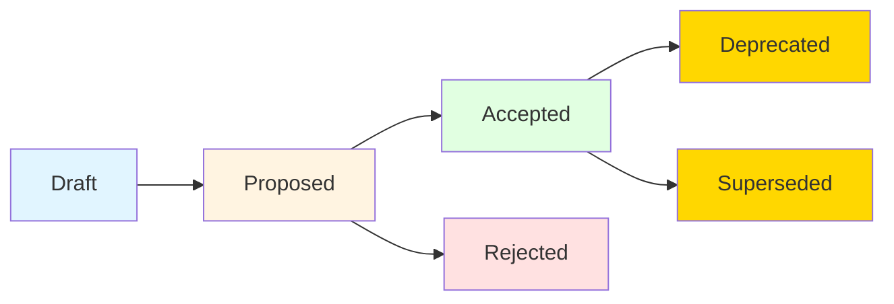

# Architecture Decision Records (ADR)

---

Last Updated: 2025-10-03
Owner: Architecture Team
Review Cadence: Quarterly

---

## Overview

This directory contains Architecture Decision Records (ADRs) that document significant architectural and technical decisions made in the NVIDIA NeMoRetriever RAG Template project.

## What is an ADR?

An Architecture Decision Record (ADR) is a document that captures an important architectural decision made along with its context and consequences. ADRs help teams:

- **Document decisions**: Create a permanent record of why certain choices were made
- **Share context**: Help new team members understand the rationale behind current architecture
- **Track evolution**: Show how the system architecture has evolved over time
- **Avoid repeating mistakes**: Learn from past decisions and their outcomes
- **Enable informed changes**: Provide context for future architectural decisions

## ADR Format

We follow the format popularized by Michael Nygard with enhancements for our pharmaceutical RAG domain:

1. **Title**: ADR-NNNN: Descriptive title
2. **Metadata**: Status, deciders, dates
3. **Status**: Proposed, Accepted, Deprecated, or Superseded
4. **Context**: The issue and forces at play
5. **Decision**: What we decided to do
6. **Consequences**: Positive, negative, and trade-offs
7. **Alternatives**: What else was considered and why rejected
8. **Implementation Notes**: Key details for implementation
9. **References**: Links to related ADRs and documentation
10. **Review**: Review cadence and update triggers

## Creating a New ADR

### Using the Helper Script

```bash
# Generate next ADR number and create from template
./scripts/new-adr.sh "your-decision-title"
```

### Manual Process

1. Determine the next ADR number (see index below)
2. Copy `template.md` to `NNNN-your-title.md`
3. Fill in all sections
4. Update the ADR index below
5. Link from related documentation

## ADR Index

| Number                               | Title                                        | Status   | Date       | Deciders          |
| ------------------------------------ | -------------------------------------------- | -------- | ---------- | ----------------- |
| [0001](./0001-use-nemo-retriever.md) | Adopt NVIDIA NeMo Retriever for RAG Pipeline | Accepted | 2025-01-15 | Architecture Team |

## ADR Lifecycle



### Status Definitions

- **Proposed**: Decision is under consideration
- **Accepted**: Decision has been approved and is being/has been implemented
- **Deprecated**: Decision is no longer relevant but kept for historical record
- **Superseded**: Decision has been replaced by a newer ADR (link to superseding ADR)
- **Rejected**: Decision was proposed but not approved (kept for historical record)

## When to Create an ADR

Create an ADR when making decisions about:

- **Architecture**: System structure, component organization, deployment model
- **Technology Selection**: Frameworks, libraries, platforms, services
- **Standards**: Coding standards, API design, data formats
- **Process**: Development workflows, testing strategies, deployment processes
- **Significant Changes**: Major refactoring, paradigm shifts, breaking changes

## ADR Best Practices

1. **Write Early**: Create ADRs when the decision is made, not after implementation
2. **Be Concise**: Focus on the decision and rationale, not implementation details
3. **Be Honest**: Document drawbacks and trade-offs transparently
4. **Show Alternatives**: Demonstrate that multiple options were considered
5. **Link Everything**: Connect to related ADRs and documentation
6. **Keep Current**: Update status as decisions evolve
7. **Review Regularly**: Schedule periodic reviews to ensure decisions remain valid

## Numbering Scheme

- ADRs are numbered sequentially: 0001, 0002, 0003, etc.
- Numbers are zero-padded to 4 digits
- Numbers are never reused, even for rejected ADRs
- If an ADR is superseded, create a new ADR with the next number

## Superseding ADRs

When replacing an existing decision:

1. Create a new ADR with the next sequential number
2. Reference the superseded ADR in the new ADR's context
3. Update the old ADR's status to "Superseded by ADR-XXXX"
4. Update this index with both ADRs' new status

## Related Documentation

- [Architecture Overview](../ARCHITECTURE.md)
- [Development Guide](../DEVELOPMENT.md)
- [API Integration Guide](../API_INTEGRATION_GUIDE.md)
- [NGC Deprecation Immunity](../NGC_DEPRECATION_IMMUNITY.md)

## Resources

- [Michael Nygard's ADR template](http://thinkrelevance.com/blog/2011/11/15/documenting-architecture-decisions)
- [ADR GitHub organization](https://adr.github.io/)
- [When to use ADRs](https://cognitect.com/blog/2011/11/15/documenting-architecture-decisions)

---

**Last Updated**: 2025-01-15
**Maintainer**: Architecture Team
**Review Cadence**: Quarterly
