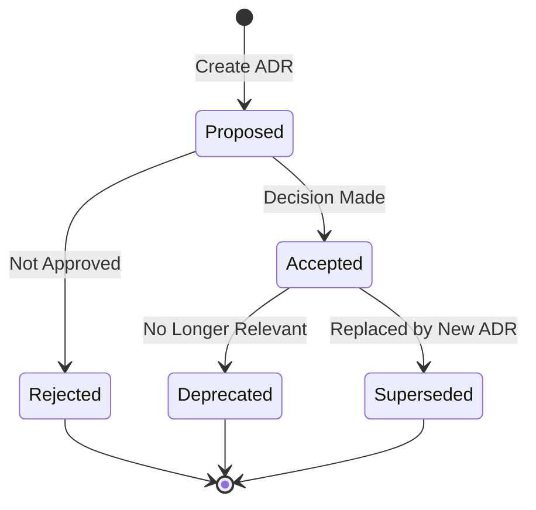

# ADR-NNNN: [Short Descriptive Title]

---

Last Updated: YYYY-MM-DD
Owner: Architecture Team
Review Cadence: Quarterly
Status: [Proposed | Accepted | Deprecated | Superseded]
Deciders: [List of people involved]
Date: YYYY-MM-DD
Template Version: 1.0

---

## Status

Current state: [Proposed | Accepted | Deprecated | Superseded by ADR-XXXX]

## Context

What is the issue we're facing?

- Describe the forces at play (technical, political, social, project)
- What constraints exist?
- Include relevant background information
- Explain why this decision needs to be made now

## Decision

What is the change we're proposing/making?

- Be specific and concrete
- Use active voice: "We will..."
- Clearly state what will be done

## Consequences

### Positive Consequences

- What becomes easier?
- What benefits do we gain?
- How does this improve the system?

### Negative Consequences

- What becomes harder?
- What costs or limitations are introduced?
- What maintenance burden is added?

### Trade-offs

- What did we sacrifice to gain the benefits?
- What risks are we accepting?
- How are we mitigating those risks?

## Alternatives Considered

### Alternative 1: [Name]

- **Description**: Brief description of the alternative
- **Pros**: List advantages
- **Cons**: List disadvantages
- **Reason for Rejection**: Why this wasn't chosen

### Alternative 2: [Name]

- **Description**: Brief description of the alternative
- **Pros**: List advantages
- **Cons**: List disadvantages
- **Reason for Rejection**: Why this wasn't chosen

### Alternative 3: [Name]

- **Description**: Brief description of the alternative
- **Pros**: List advantages
- **Cons**: List disadvantages
- **Reason for Rejection**: Why this wasn't chosen

## Implementation Notes

- Key implementation details
- Migration considerations
- Rollback strategy
- Timeline and milestones

## References

- Related ADR-XXXX: Link to related ADR when applicable
- [External Documentation](https://example.com)
- [Discussion Thread](https://github.com/org/repo/issues/123)
- [Related Architecture Document](../ARCHITECTURE.md)

## Review and Updates

- **Review Cadence**: [Quarterly | Annually | As needed]
- **Next Review Date**: YYYY-MM-DD
- **Update Triggers**: Conditions that would require updating this ADR

---

## Usage Instructions

1. **Copy this template** to create new ADRs
2. **Number sequentially**: 0001, 0002, 0003, etc.
3. **Use descriptive titles**: `0001-use-nemo-retriever.md`, `0002-adopt-cloud-first-strategy.md`
4. **Update status** as decisions evolve (Proposed → Accepted → Deprecated/Superseded)
5. **Link related ADRs** bidirectionally
6. **Keep it concise**: Focus on the decision and rationale, not implementation details
7. **Update metadata** when reviewing or changing the ADR

## Example Naming Convention

```
0001-use-nemo-retriever.md
0002-adopt-cloud-first-strategy.md
0003-implement-pharmaceutical-guardrails.md
0004-select-vector-database.md
0005-define-caching-strategy.md
```

## ADR Lifecycle



## Tips for Writing Good ADRs

1. **Context is King**: Provide enough background so future readers understand why this decision mattered
2. **Be Honest**: Document negative consequences and trade-offs transparently
3. **Alternatives Matter**: Show you considered multiple options and explain why you chose this one
4. **Stay Focused**: Keep the ADR about the decision, not the implementation
5. **Link Everything**: Connect to related ADRs, docs, and discussions
6. **Update Status**: Keep the status current as the decision evolves
7. **Review Regularly**: Schedule periodic reviews to ensure the decision is still valid
8. **Be Specific**: Use concrete examples and metrics where possible
9. **Think Long-Term**: Consider maintainability and future implications
10. **Document Assumptions**: Make implicit assumptions explicit
