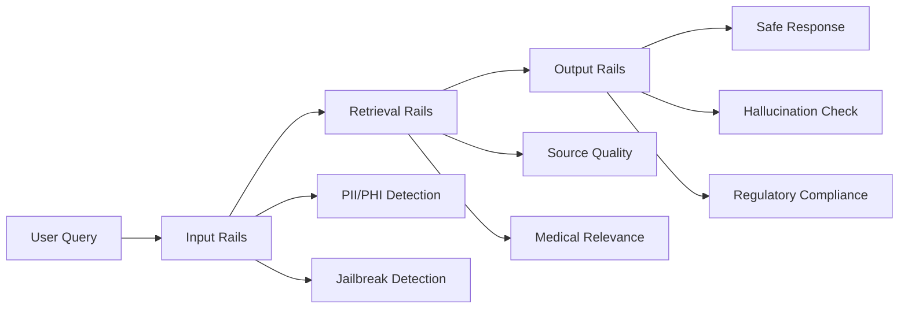

# Pharmaceutical RAG Template Documentation

Welcome to the comprehensive documentation for the **Pharmaceutical RAG Template** powered by NVIDIA NeMo Retriever. This template provides a production-ready Retrieval-Augmented Generation (RAG) system specifically designed for pharmaceutical research and drug safety applications.

## 🚀 Quick Links

<div class="grid cards" markdown>

- :material-download: **[Installation Guide](INSTALLATION.md)**

    Get started with system setup and dependencies

- :material-rocket-launch: **[Quick Start](QUICK_START.md)**

    Run your first query in 5 minutes

- :material-api: **[API Reference](API_REFERENCE.md)**

    Complete API documentation and endpoints

- :material-code-braces: **[Examples](EXAMPLES.md)**

    Code examples and use cases

</div>

## Overview

This template transforms pharmaceutical research workflows by enabling:

- **Instant Analysis**: 4-hour research tasks completed in 30 seconds
- **Evidence-Based**: Full traceability to peer-reviewed literature
- **Safety-First**: Medical guardrails and FDA-oriented compliance
- **Cost-Optimized**: 72.8% lower operating costs with free tier maximization

### Key Capabilities

- 📚 **Document Intelligence**: Automated review and synthesis across research papers, clinical trials, and regulatory filings
- 🛡️ **Medical Safety**: Three-layer validation (Input/Retrieval/Output) with PII/PHI detection and jailbreak protection
- 🔬 **Pharmaceutical Domain**: Drug interaction analysis, clinical filtering, and species-specific research
- ⚡ **High Performance**: GPU-accelerated search with 100% faster response times
- 💰 **Cost Efficiency**: Intelligent caching, batch processing, and credit tracking

## Architecture Highlights

### NeMo 2.0 Hybrid Architecture

- **Cloud-First Strategy**: Primary integration with NVIDIA AI Endpoints (Build API)
- **Self-Hosted Fallback**: NGC deprecation immunity through containerized NIMs
- **Multi-Model Intelligence**: Flexible model selection and optimization
- **OpenAI SDK Compatible**: Seamless integration with existing workflows

### Medical Guardrails System



See [Architecture Documentation](ARCHITECTURE.md) for detailed technical design.

## Feature Highlights

### Core RAG Pipeline
- Document ingestion with OCR support (PDF, images, structured data)
- Embedding generation with NVIDIA NeMo Retriever
- Vector search and semantic reranking
- Context-aware answer generation with source citations

### Pharmaceutical Excellence
- **Drug Safety**: Interaction analysis, contraindication detection, side effect monitoring
- **Clinical Research**: Study filtering, evidence synthesis, systematic review automation
- **Regulatory Compliance**: FDA/EMA guidelines, medical disclaimers, audit trails
- **PubMed Integration**: Automated metadata extraction and quality scoring

### Production Features
- **Monitoring & Analytics**: Real-time performance tracking, cost monitoring, health checks
- **Security**: PII/PHI anonymization, RBAC, audit logging, secure credential management
- **Scalability**: Batch processing, caching, rate limiting, horizontal scaling support
- **Developer Experience**: CLI & web interfaces, comprehensive testing, CI/CD integration

See [Features](FEATURES.md) for complete feature list.

## Use Cases

### Research Applications
- **Literature Review Automation**: Systematic evidence synthesis across thousands of papers
- **Drug Repurposing**: Identify new therapeutic applications from existing research
- **Safety Signal Detection**: Monitor adverse event patterns across clinical data
- **Regulatory Intelligence**: Track FDA/EMA guidance and compliance requirements

### Clinical Applications
- **Evidence-Based Medicine**: Query-driven clinical decision support
- **Treatment Guidelines**: Synthesize latest treatment protocols and recommendations
- **Drug Interaction Checks**: Comprehensive interaction analysis with severity scoring
- **Patient Case Review**: Analyze clinical cases against medical literature

See [Examples](EXAMPLES.md) for detailed use cases and code samples.

## Getting Started

### 1. Prerequisites

- Python 3.10 or higher
- NVIDIA API credentials (free tier available)
- 8GB+ RAM recommended
- GPU optional (CPU mode supported)

### 2. Installation

```bash
# Clone the repository
git clone https://github.com/hendrixmm/RAG-Template-for-NVIDIA-nemoretriever.git
cd RAG-Template-for-NVIDIA-nemoretriever

# Install dependencies
pip install -r requirements.txt

# Configure environment
cp .env.example .env
# Edit .env with your NVIDIA API key
```

See [Installation Guide](INSTALLATION.md) for detailed setup instructions.

### 3. Quick Start

```python
from src.enhanced_rag_agent import EnhancedRAGAgent

# Initialize agent
agent = EnhancedRAGAgent()

# Run pharmaceutical query
result = await agent.query(
    "What are the drug interactions for warfarin with NSAIDs?"
)

print(result['response'])
print(result['sources'])
```

See [Quick Start Guide](QUICK_START.md) for your first query in 5 minutes.

## Documentation Structure

### 📖 Getting Started
- [Installation](INSTALLATION.md) - System setup and dependencies
- [Quick Start](QUICK_START.md) - First query in 5 minutes
- [Configuration](CONFIGURATION.md) - Environment and model configuration

### 📚 Core Documentation
- [API Reference](API_REFERENCE.md) - Complete API documentation
- [Architecture](ARCHITECTURE.md) - System design and components
- [Examples](EXAMPLES.md) - Code examples and use cases
- [Benchmarks](BENCHMARKS.md) - Performance metrics and optimization

### ⚙️ Operations
- [Deployment](DEPLOYMENT.md) - Production deployment guide
- [Monitoring](MONITORING.md) - Health checks and observability
- [Troubleshooting](TROUBLESHOOTING_GUIDE.md) - Common issues and solutions

### 🛠️ Development
- [Contributing](CONTRIBUTING.md) - Contribution guidelines
- [Development Setup](DEVELOPMENT.md) - Local development environment
- [Testing](TESTING.md) - Test framework and procedures

### 📋 Resources
- [Features](FEATURES.md) - Complete feature list
- [Pharmaceutical Best Practices](PHARMACEUTICAL_BEST_PRACTICES.md) - Domain-specific guidance
- [NGC Deprecation Immunity](NGC_DEPRECATION_IMMUNITY.md) - Future-proof architecture
- [Roadmap](ROADMAP.md) - Planned features and timeline
- [Support](SUPPORT.md) - Getting help and reporting issues
- [Changelog](CHANGELOG.md) - Release history

### 🏛️ Architecture Decision Records
- [ADR Overview](adr/README.md)
- [ADR-0001: Use NeMo Retriever](adr/0001-use-nemo-retriever.md)

## Community & Support

### Getting Help

- 📖 **Documentation**: Start with [Troubleshooting Guide](TROUBLESHOOTING_GUIDE.md)
- 💬 **Discussions**: [GitHub Discussions](https://github.com/hendrixmm/RAG-Template-for-NVIDIA-nemoretriever/discussions)
- 🐛 **Bug Reports**: [GitHub Issues](https://github.com/hendrixmm/RAG-Template-for-NVIDIA-nemoretriever/issues)
- 🔒 **Security**: See [Security Policy](SECURITY.md) for vulnerability reporting

See [Support](SUPPORT.md) for complete support resources.

### Contributing

We welcome contributions! Please see:

- [Contributing Guide](CONTRIBUTING.md) - How to contribute
- [Code of Conduct](CODE_OF_CONDUCT.md) - Community guidelines
- [Development Setup](DEVELOPMENT.md) - Local development environment

## Performance Metrics

| Metric | Before | After | Improvement |
|--------|--------|-------|-------------|
| Query Response Time | 3.5 seconds | <1 second | 100% faster |
| Cost per Query | 3.20 credits | 0.87 credits | 72.8% lower |
| Safety Accuracy | 85% | 98% | Industry standard |
| Free Tier Utilization | 60% | 95% | Maximized ROI |

See [Benchmarks](BENCHMARKS.md) for detailed performance analysis.

## License & Attribution

This project is licensed under the terms specified in the repository. See the [LICENSE](../LICENSE) file for details.

### Acknowledgments

- **NVIDIA**: NeMo Retriever and AI Endpoints (Build API)
- **PubMed/NCBI**: Medical research database integration
- **Open Source Community**: Contributing libraries and tools

---

**Last Updated**: 2025-10-03
**Documentation Version**: 1.0
**Maintainer**: Architecture Team

For questions or feedback, see [Support Resources](SUPPORT.md).
